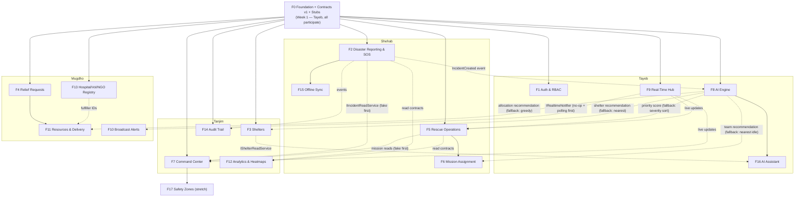

# RapidRelief — Feature-Based Team Development Plan

**AI Smart Disaster Response & Emergency Management System**
Semester project · 4 developers · Vertical feature ownership · Zero-blocking parallel development

> Planning assumptions: ~13-week semester, ~10 productive hours/developer/week ⇒ ~480 total developer-hours available. Plan budgets ~420h core + stretch, leaving buffer for exams, illness, and rework.

---

## 1. System Understanding

RapidRelief is a disaster-response coordination platform. Its core loop:

**Citizen reports a disaster (GPS + photos, or one-tap SOS) → AI classifies it, estimates severity, scores priority, and detects duplicates → Rescue teams see a priority-ranked queue, accept missions, and update status live → Government admins monitor everything in a command center, verify incidents, and manage shelters/hospitals/teams → Citizens request relief (food/water/medicine/shelter) → Resources are allocated, dispatched, and tracked to delivery by NGOs/volunteers.**

Cross-cutting capabilities: interactive maps everywhere, real-time updates, offline report capture with sync, role-based security, and audit logging.

The product is essentially **five actor-facing applications sharing one platform**: Citizen app, Rescue app, Admin command center, Relief/NGO operations, and an AI engine that enriches everything. This decomposition is what makes clean vertical ownership possible.

### 1.1 Technology Selection (decided _after_ requirements analysis)

> **Implementation note (updated 2026-09-03):** everything below is the *original plan*. Where reality diverged, [PROJECT-CONTEXT.md](PROJECT-CONTEXT.md) §7 decisions are authoritative — notably D-006 (hand-rolled event bus replaced MediatR), D-060…D-066 (AI provider is OpenRouter free models, not Gemini), D-032 (Realtime tri-state mode), **D-070 (four roles collapsed to three: `Citizen` / `Rescuer` / `Government`; "Admin" and "NGO" are aliases of `Government` throughout this plan)**, **D-074 (brand palette: Forest Green action, no blue)** and **D-079 (F2/F4/F5 shipped schema + UI before endpoints)**. See PROJECT-CONTEXT.md for the live stack and status.

Only .NET is mandated. Choices below optimize for: one language for the whole team, zero licensing cost, offline support, real-time support, and demo reliability.

| Concern      | Choice                                                                                                                              | Why (and what was rejected)                                                                                                                                                                                                                        |
| ------------ | ----------------------------------------------------------------------------------------------------------------------------------- | -------------------------------------------------------------------------------------------------------------------------------------------------------------------------------------------------------------------------------------------------- |
| Backend      | **ASP.NET Core 8 (LTS) Web API** — modular monolith, vertical slice architecture                                                    | Microservices rejected: massive ops overhead for 4 students, kills the semester. Modular monolith gives feature isolation _and_ one-command run.                                                                                                   |
| Frontend     | **Blazor WebAssembly (hosted) + PWA**                                                                                               | One language (C#) for all 4 devs — no one is blocked on learning React. PWA template gives the service worker needed for offline reporting (wow feature). Blazor Server rejected: no offline story. React rejected: splits team across two stacks. |
| Database     | **PostgreSQL 16 + EF Core 8 (Npgsql)**                                                                                              | Free everywhere (local via Docker, cloud via Neon/Supabase free tier). SQL Server Express is an acceptable fallback if the whole team stays on Windows — EF Core makes the swap cheap.                                                             |
| Real-time    | **SignalR**                                                                                                                         | Built into ASP.NET Core; C# client in Blazor. No third-party cost.                                                                                                                                                                                 |
| Maps         | **Leaflet + OpenStreetMap** via a small JS-interop wrapper component                                                                | Completely free, no API key, no quota risk during the demo. Google Maps rejected: billing account requirement. Directions = straight-line distance + "Open in Google Maps" deep link (free).                                                       |
| AI           | **Google Gemini free tier** (text + vision) behind an `IAiAnalysisService` interface, with a **rule-based fallback implementation** | Free multimodal API covers image analysis + classification. The rule-based fallback means the demo _cannot fail_ due to quota/network — and it's the key to independence (see §1.5). ML.NET optional stretch for the predictive feature.           |
| Auth         | **ASP.NET Core Identity + JWT (+ refresh tokens)**                                                                                  | Standard, well-documented, works with SignalR and Blazor WASM.                                                                                                                                                                                     |
| File storage | Local disk in dev behind `IFileStorage`; Cloudinary free tier or Azure Blob for deployment                                          | Interface-first so the swap is one DI line.                                                                                                                                                                                                        |
| Testing      | **xUnit** + `WebApplicationFactory` integration tests; NetArchTest for architecture rules                                           | Architecture tests mechanically enforce module isolation (impressive for faculty, protective for the team).                                                                                                                                        |
| CI/CD        | **GitHub Actions** (build + test on every PR)                                                                                       | Free for education.                                                                                                                                                                                                                                |
| Deployment   | Azure App Service (student credits) or Render free tier; **local run is the demo fallback**                                         | Never bet the demo on free-tier cold starts.                                                                                                                                                                                                       |

**Total external cost: $0.**

### 1.2 Solution Structure

```
RapidRelief.sln
├─ src/
│  ├─ RapidRelief.Api/            # ASP.NET Core Web API (modular monolith)
│  │   └─ Features/
│  │       ├─ Auth/               # each folder: endpoints + services + entities
│  │       ├─ Incidents/          #   + module DbContext + migrations
│  │       ├─ Rescue/
│  │       ├─ Shelters/
│  │       ├─ Admin/
│  │       ├─ Relief/
│  │       ├─ Resources/
│  │       ├─ Registry/           # hospitals, volunteers, NGOs
│  │       ├─ Ai/
│  │       ├─ Realtime/
│  │       ├─ Alerts/
│  │       ├─ Analytics/
│  │       └─ Audit/
│  ├─ RapidRelief.Client/         # Blazor WASM PWA, mirrored Features/ folders
│  └─ RapidRelief.Shared/         # Contracts ONLY: DTOs, enums, event records,
│                                 #   cross-module interfaces. No logic.
└─ tests/
   ├─ RapidRelief.Api.Tests/
   └─ RapidRelief.Architecture.Tests/   # NetArchTest module-isolation rules
```

**Rule: a feature folder may reference `Shared/Contracts` and its own folder. Never another feature's folder.** Enforced by architecture tests + CODEOWNERS.

---

## 1.5 ⚡ The Zero-Blocking Independence Model (how nobody ever waits)

This is the contract that makes "I never wait for a teammate" true from **Day 3** onward.

| #   | Mechanism                                                 | What it means in practice                                                                                                                                                                                                                                                                                                                                                                                                                |
| --- | --------------------------------------------------------- | ---------------------------------------------------------------------------------------------------------------------------------------------------------------------------------------------------------------------------------------------------------------------------------------------------------------------------------------------------------------------------------------------------------------------------------------- |
| 1   | **Contract-first Week 1**                                 | Days 1–2: whole team runs a "contract workshop" and freezes `Shared/Contracts` v1 — all DTOs, enums, event records, and cross-module interface signatures. After that, changing a contract requires a special PR (see §9). You code against contracts, not against teammates.                                                                                                                                                            |
| 2   | **Stub every shared service on Day 1**                    | Foundation ships working fakes: `FakeAuthHandler` (dev-only — any request with header `X-Dev-Role: Admin` is authenticated in that role), `RuleBasedAiService`, `NoOpRealtimeNotifier` (+ polling fallback component), `LocalDiskFileStorage`. Real implementations replace fakes via DI with **zero consumer changes**.                                                                                                                 |
| 3   | **Fake read services + rich seed data**                   | Every cross-module _read_ goes through a contract interface (e.g., `IIncidentReadService`, `IShelterReadService`). Foundation ships fake implementations returning realistic seeded data. Example: Tanjim builds the entire command center against `FakeIncidentReadService` — he needs **zero lines** of Shehab's code. When Shehab's module registers the real implementation, Tanjim's screens light up with real data automatically. |
| 4   | **One DbContext + migration set per owner domain**        | `AuthDbContext`, `IncidentsDbContext` (incidents + missions), `OpsDbContext` (shelters/analytics/audit), `ReliefDbContext` (relief/resources/registry), `AiDbContext`. Separate migration histories = **EF migration merge conflicts are structurally impossible** between developers (the #1 classic team blocker).                                                                                                                     |
| 5   | **No cross-module foreign keys or navigation properties** | Reference other modules by plain `Guid` ID only. Your schema changes never break anyone else's migrations or entities. Enforced by architecture tests.                                                                                                                                                                                                                                                                                   |
| 6   | **Event-driven integration, fire-and-forget**             | Modules communicate via in-process events (`IncidentCreated`, `IncidentAssessed`, `MissionStatusChanged`, `ReliefRequested`, …) on a simple event bus (MediatR notifications). Publisher doesn't care if zero or five subscribers exist — a missing subscriber breaks nothing.                                                                                                                                                           |
| 7   | **Seeded demo users & data per module**                   | `citizen1@rr.dev`, `rescue1@rr.dev`, `admin1@rr.dev`, `ngo1@rr.dev` (password `Demo!123`) + sample incidents/shelters/resources seeded on startup. Nobody needs anyone else's UI flow to test their own screens.                                                                                                                                                                                                                         |
| 8   | **Folder ownership + CODEOWNERS**                         | Each dev merges freely inside their `Features/X` folders. Merge conflicts approach zero because files are never co-edited.                                                                                                                                                                                                                                                                                                               |
| 9   | **Integration days, not integration coupling**            | Three scheduled half-day integration checkpoints (end of Wk 4, 7, 10) where fakes are swapped for real implementations pair-by-pair and smoke-tested. Between checkpoints, everyone runs fully standalone.                                                                                                                                                                                                                               |

> **Net effect:** the dependency graph in §5 has exactly **one** hard shared node — the Week-1 foundation. Every cross-developer edge is "soft": satisfied by a stub until the real thing lands, never blocking.

---

## 2. Feature Inventory

Complexity: L / M / H / VH. Effort in developer-hours. "F0 (contracts)" as a dependency means: _needs only the Week-1 contracts + stubs — never a teammate's finished feature._

| ID  | Feature                                                                               | Primary Actor   | Complexity | Effort | Dependencies              |
| --- | ------------------------------------------------------------------------------------- | --------------- | ---------- | ------ | ------------------------- |
| F0  | Platform Foundation & Shared Kernel                                                   | All (dev team)  | H          | 22h    | —                         |
| F1  | Authentication, Profiles & RBAC                                                       | All users       | H          | 24h    | F0                        |
| F2  | Disaster Reporting & SOS                                                              | Citizen         | VH         | 38h    | F0 (contracts)            |
| F3  | Shelter Management & Nearby-Shelter Finder                                            | Admin + Citizen | M          | 24h    | F0 (contracts)            |
| F4  | Relief Requests & Tracking                                                            | Citizen         | M          | 24h    | F0 (contracts)            |
| F5  | Rescue Team Operations (queue, missions, status)                                      | Rescue          | VH         | 36h    | F0 (contracts)            |
| F6  | Mission Assignment & Team Registry                                                    | Admin + Rescue  | H          | 18h    | F5 (same owner)           |
| F7  | Admin Command Center & Incident Verification                                          | Admin           | H          | 32h    | F0 (contracts)            |
| F8  | AI Analysis Engine (classify, severity, image, priority, duplicates, recommendations) | System (AI)     | VH         | 34h    | F0 (contracts)            |
| F9  | Real-Time Hub & Notification Center                                                   | All users       | H          | 22h    | F0                        |
| F10 | Emergency Broadcast Alerts                                                            | Admin → Citizen | M          | 16h    | F0 (contracts)            |
| F11 | Resource Inventory, Allocation & Delivery Tracking                                    | Admin + NGO     | M–H        | 30h    | F0 + F4 (same owner)      |
| F12 | Analytics, Heatmaps & Response Metrics                                                | Admin           | M–H        | 26h    | F0 (contracts, read-only) |
| F13 | Hospital, Volunteer & NGO Registry                                                    | Admin + NGO     | M          | 22h    | F0 (contracts)            |
| F14 | Audit Trail                                                                           | Admin           | M          | 14h    | F0 (event bus)            |
| F15 | Offline Reporting & Auto-Sync (PWA)                                                   | Citizen         | H          | 22h    | F2 (same owner)           |
| F16 | AI Emergency Assistant (chat)                                                         | Citizen         | M–H        | 16h    | F8 (same owner)           |
| F17 | Safety Zones & Road Closures _(stretch)_                                              | Admin + Citizen | M          | 12h    | F7 (same owner)           |

**Total: ~420h core (F0–F16) + 12h stretch (F17).**

Note how every dependency that crosses a developer boundary is "F0 (contracts)" — by design. Hard dependencies (F5→F6, F2→F15, F8→F16, F4→F11, F7→F17) all stay **inside one owner's lane**, so they sequence one person's own work rather than blocking a teammate.

### Feature Details

<details>
<summary><strong>F0 — Platform Foundation & Shared Kernel</strong> (expand)</summary>

- **Purpose:** Everything the team shares, delivered in Week 1 so all four lanes open.
- **Owner:** Tayeb (lead) — contract workshop involves everyone.
- **Scope:** Solution skeleton; EF Core + PostgreSQL via docker-compose; global error handling (ProblemDetails) + Serilog logging; environment config; JWT plumbing + `FakeAuthHandler` dev bypass; seeded role users; `Shared/Contracts` v1 (DTOs, enums, events, interfaces); event bus (MediatR notifications); `IFileStorage` + local impl; `IRealtimeNotifier` + no-op impl; `IAiAnalysisService` + rule-based stub; fake read services + seed data; `<RapidMap>` Leaflet wrapper component; GitHub Actions CI; architecture tests skeleton; README run-guide.
- **Definition of Done:** fresh clone → `docker compose up -d` → `dotnet run` → seeded app opens; a sample vertical slice ("Feature Zero" ping feature) demonstrates the folder pattern end-to-end; all 4 devs have run it locally.
</details>

<details>
<summary><strong>F1 — Authentication, Profiles & RBAC</strong></summary>

- **Purpose:** Real identity for all actors; the security backbone.
- **Owner:** Tayeb. **Complexity:** H · 24h.
- **Scope:** Register/login (Identity + JWT + refresh); roles Citizen/Rescue/Admin/NGO; authorization policies per area; profile page (name, phone, emergency contact, photo); account lock/unlock + role assignment exposed via `IUserAdminService` contract (consumed by F7's user-management UI); auth events published for audit; input validation; rate limiting on auth endpoints.
- **DoD:** All roles can register/login/refresh; policies proven by integration tests; `FakeAuthHandler` still works in Development so teammates are unaffected; seeded users keep working.
</details>

<details>
<summary><strong>F2 — Disaster Reporting & SOS</strong></summary>

- **Purpose:** The system's primary input: citizens report disasters; owns the Incident aggregate + status state machine (Reported → Verified → Assigned → InProgress → Resolved / Rejected).
- **Owner:** Shehab. **Complexity:** VH · 38h.
- **Scope:** DB (Incidents, IncidentMedia, IncidentStatusHistory); report wizard (type, description, GPS auto-capture, manual map-pin fallback, photo/video upload with type/size validation); SOS one-tap flow (minimal input + location); My Reports list + status timeline UI; publishes `IncidentCreated`; implements real `IIncidentReadService` + `IIncidentStatusService` (replacing foundation fakes); error handling; idempotency key on submission (shared with F15); tests.
- **DoD:** Citizen can file report with photos and see live status; SOS lands in < 3 taps; incident data visible through the read contract; state machine transitions validated + tested.
</details>

<details>
<summary><strong>F3 — Shelter Management & Nearby-Shelter Finder</strong></summary>

- **Purpose:** Admins manage shelters; citizens find the nearest one with capacity.
- **Owner:** Tanjim. **Complexity:** M · 24h.
- **Scope:** DB (Shelters: location, capacity, occupancy, facilities, status); admin CRUD + occupancy update UI; citizen finder — distance-sorted list (Haversine) + map layer + "Open in Google Maps" directions link; implements `IShelterReadService`; consumes AI shelter recommendation with **nearest-available fallback** so it works before/without F8; validation; tests.
- **DoD:** Admin manages shelters; citizen sees nearest shelters with live capacity on map and list; works with AI stub alone.
</details>

<details>
<summary><strong>F4 — Relief Requests & Tracking</strong></summary>

- **Purpose:** Citizens request food/water/medicine/shelter; requests become trackable work items.
- **Owner:** Mugdho. **Complexity:** M · 24h.
- **Scope:** DB (ReliefRequests: type, quantity, urgency, location, householdSize, status); citizen request form + My Requests with status timeline (Pending → Approved → Allocated → Dispatched → Delivered); admin/NGO triage queue (approve/reject with reason); publishes `ReliefRequested`; validation; error handling; tests.
- **DoD:** End-to-end: citizen submits → admin approves → citizen sees status change. Feeds F11 (same owner).
</details>

<details>
<summary><strong>F5 — Rescue Team Operations</strong></summary>

- **Purpose:** The rescue-side workflow: see prioritized incidents, run missions.
- **Owner:** Shehab. **Complexity:** VH · 36h.
- **Scope:** DB (Missions, MissionStatusHistory, TeamStatus); rescue dashboard; priority incident queue (sorted by AI priority score **with severity/recency fallback ordering** when score absent); incident detail + victim location map + distance; accept mission; status updates (EnRoute → OnScene → Completed) with timestamps; active/completed mission lists; publishes `MissionStatusChanged`; team availability states; tests.
- **DoD:** Rescue user works a mission end-to-end from queue to completion; queue renders correctly with and without AI scores.
</details>

<details>
<summary><strong>F6 — Mission Assignment & Team Registry</strong></summary>

- **Purpose:** Admin-side dispatch: manage rescue teams, assign/reassign missions.
- **Owner:** Shehab (kept in the rescue domain so admin-UI ↔ mission coupling stays in one lane). **Complexity:** H · 18h.
- **Scope:** Rescue team registry CRUD (members, skills, base location); admin assignment screen (manual assign = MVP); AI team recommendation consumption with **nearest-idle-team fallback**; reassignment + audit events; notification to assigned team via `IRealtimeNotifier` (no-op safe).
- **DoD:** Admin assigns a team; team sees it instantly (or on refresh pre-F9); recommendation panel shows ranked teams.
</details>

<details>
<summary><strong>F7 — Admin Command Center & Incident Verification</strong></summary>

- **Purpose:** The government's single pane of glass.
- **Owner:** Tanjim. **Complexity:** H · 32h.
- **Scope:** Ops board — filterable incident table + multi-layer map (incidents/teams/shelters via read contracts, each layer independent); incident verification workflow (approve/reject; shows AI severity, summary, and duplicate suggestions _when present_ — fields simply hidden if AI hasn't populated them); user management UI via `IUserAdminService` contract; dashboards shell that hosts F12; built entirely against fake read services first.
- **DoD:** Admin monitors seeded + real incidents on map/table, verifies or rejects with reason, manages users — all functional with fakes only, automatically richer as real modules land.
</details>

<details>
<summary><strong>F8 — AI Analysis Engine</strong></summary>

- **Purpose:** The intelligence layer: enrich every incident automatically; recommend everything.
- **Owner:** Tayeb. **Complexity:** VH · 34h.
- **Scope:** Subscribes to `IncidentCreated` → runs pipeline: disaster-type classification, severity estimation (1–5), photo damage analysis (Gemini Vision), incident summary, priority score (0–100: severity + population proximity + recency + SOS flag), duplicate detection (geo-radius + time-window + type match → links `PossibleDuplicateOfId`); persists `AiAssessment` (own DbContext, linked by IncidentId); publishes `IncidentAssessed`; recommendation endpoints — shelter, rescue team, resource allocation; **provider chain: Gemini → rule-based fallback on timeout/quota/failure** (circuit-breaker style); prompt-injection-safe prompting (user text is data, never instructions); tests incl. golden-file classification cases.
- **DoD:** New incident gets a full assessment within seconds with Gemini ON or OFF; consumers read scores via contract; duplicate pairs correctly flagged in seeded scenarios.
</details>

<details>
<summary><strong>F9 — Real-Time Hub & Notification Center</strong></summary>

- **Purpose:** Live updates everywhere; the real `IRealtimeNotifier`.
- **Owner:** Tayeb. **Complexity:** H · 22h.
- **Scope:** SignalR hub with JWT auth + role/user groups; real `IRealtimeNotifier` implementation (replaces no-op in one DI line); client notification center (toasts + inbox + unread badge + persistence); live wiring helpers consumed by F5 queue, F7 ops board, F10 alerts; graceful degradation — consumers keep their polling fallback component; reconnection handling.
- **DoD:** Two browsers side-by-side: action in one appears in the other < 2s; disabling the hub degrades to polling without errors.
</details>

<details>
<summary><strong>F10 — Emergency Broadcast Alerts</strong></summary>

- **Purpose:** Admin broadcasts warnings ("Flood level rising in Zone 3 — evacuate") to citizens.
- **Owner:** Mugdho. **Complexity:** M · 16h.
- **Scope:** DB (Alerts: title, body, severity, disaster type, target area, expiry); admin compose + history UI; citizen alert banner + alert inbox; delivery via `IRealtimeNotifier` (works with no-op + polling before F9; instant after); acknowledgment tracking (stretch); validation; tests.
- **DoD:** Admin publishes alert → citizen sees banner within one poll cycle (pre-F9) or instantly (post-F9).
</details>

<details>
<summary><strong>F11 — Resource Inventory, Allocation & Delivery Tracking</strong></summary>

- **Purpose:** Close the relief loop: stock → allocation → dispatch → delivered.
- **Owner:** Mugdho. **Complexity:** M–H · 30h.
- **Scope:** DB (Resources, StockLocations, Allocations, Deliveries); inventory CRUD with quantities per location + low-stock indicators; allocation screen — match stock to approved relief requests (consumes his own F4); AI allocation recommendation with **greedy nearest-stock fallback**; dispatch workflow + delivery status timeline (Preparing → Dispatched → Delivered) updating the citizen's request view; fulfillment assignment to NGO/volunteer (IDs from his own F13); tests.
- **DoD:** Full chain demoable by one person: request → approve → allocate → dispatch → delivered, stock decremented correctly.
</details>

<details>
<summary><strong>F12 — Analytics, Heatmaps & Response Metrics</strong></summary>

- **Purpose:** Decision intelligence for the command center; demo eye-candy with substance.
- **Owner:** Tanjim. **Complexity:** M–H · 26h.
- **Scope:** KPI dashboard (incidents by type/status/severity/day, active missions, shelter occupancy, relief fulfillment rate); response-time metrics (Reported→Verified→Assigned→Resolved durations, avg + p90); disaster heatmap layer (Leaflet.heat) on the ops map; charts (Chart.js interop); CSV export; reads exclusively via read contracts / own projection tables fed by events — fully functional against seed data.
- **DoD:** Dashboard renders meaningful charts from seeded data alone; heatmap toggles on ops map; numbers update as real data flows.
</details>

<details>
<summary><strong>F13 — Hospital, Volunteer & NGO Registry</strong></summary>

- **Purpose:** The directory of response capacity.
- **Owner:** Mugdho. **Complexity:** M · 22h.
- **Scope:** DB (Hospitals: location/beds/specialties/availability; Volunteers: skills/coverage/availability; NGOs: focus areas/contact); admin CRUD for all three; NGO/volunteer self-registration (role via F1 contracts, works with FakeAuth); map layers via `IRegistryReadService`; availability toggles; validation; tests.
- **DoD:** All three registries manageable + visible as map layers; hospital capacity editable and reflected in citizen/admin views.
</details>

<details>
<summary><strong>F14 — Audit Trail</strong></summary>

- **Purpose:** Accountability: who did what, when.
- **Owner:** Tanjim. **Complexity:** M · 14h.
- **Scope:** Event-bus subscriber persisting audit entries (actor, action, entity, timestamp, payload snapshot) for auth + verification + assignment + allocation + broadcast events; admin viewer with filter/search/date-range; retention note; tests.
- **DoD:** Every seeded workflow action appears in the audit viewer with correct actor + timestamp.
</details>

<details>
<summary><strong>F15 — Offline Reporting & Auto-Sync (PWA)</strong></summary>

- **Purpose:** Reports survive dead networks — the most disaster-credible feature in the system.
- **Owner:** Shehab (sits directly on his F2 form). **Complexity:** H · 22h.
- **Scope:** PWA offline detection + install; IndexedDB queue for pending reports incl. photos; background auto-sync on reconnect (client-GUID idempotency key prevents duplicates — key already built into F2); sync status UI (queued / syncing / synced / failed+retry); tests for queue logic.
- **DoD:** Airplane-mode demo: file two reports offline → reconnect → both appear server-side exactly once, statuses update.
</details>

<details>
<summary><strong>F16 — AI Emergency Assistant</strong></summary>

- **Purpose:** Conversational guidance: "There's flooding in my area, what do I do?"
- **Owner:** Tayeb. **Complexity:** M–H · 16h.
- **Scope:** Chat UI; system prompt with safety guardrails + injected context (user location, nearby shelters via `IShelterReadService`, active alerts); Gemini chat with **canned safety-response fallback**; conversation history per session; disclaimer banner; abuse/rate limiting.
- **DoD:** Assistant answers disaster-safety questions referencing actual nearby shelters; fallback path produces sensible canned guidance.
</details>

<details>
<summary><strong>F17 — Safety Zones & Road Closures (stretch)</strong></summary>

- **Purpose:** Admin marks safe/unsafe zones + closed roads; citizens see overlays.
- **Owner:** Tanjim. **Complexity:** M · 12h.
- **Scope:** Leaflet.draw polygons/lines; zone CRUD; citizen map overlay with legend.
- **DoD:** Admin draws a zone; citizen map shows it immediately.
</details>

---

## 3. Team Ownership

| Feature                               | Owner      | Complexity | Effort | Why Assigned                                                                                                             |
| ------------------------------------- | ---------- | ---------- | ------ | ------------------------------------------------------------------------------------------------------------------------ |
| F0 Foundation & Shared Kernel         | **Tayeb**  | H          | 22h    | Strongest architect; foundation quality determines everyone's velocity.                                                  |
| F1 Auth, Profiles & RBAC              | **Tayeb**  | H          | 24h    | Security backbone belongs with the foundation owner; pairs naturally with F0's JWT plumbing.                             |
| F8 AI Analysis Engine                 | **Tayeb**  | VH         | 34h    | Highest technical risk (external API, resilience, scoring design) → strongest dev.                                       |
| F9 Real-Time Hub & Notifications      | **Tayeb**  | H          | 22h    | SignalR + auth integration is infrastructure-grade; he owns both sides of it.                                            |
| F16 AI Emergency Assistant            | **Tayeb**  | M–H        | 16h    | Reuses his F8 provider chain — near-zero ramp-up.                                                                        |
| F2 Disaster Reporting & SOS           | **Shehab** | VH         | 38h    | The system's most important workflow → second-strongest dev owns the Incident aggregate.                                 |
| F5 Rescue Team Operations             | **Shehab** | VH         | 36h    | Reporting + rescue form one continuous incident lifecycle — one owner keeps the state machine coherent.                  |
| F6 Mission Assignment & Team Registry | **Shehab** | H          | 18h    | Assignment mutates missions (his aggregate); keeping it in-lane avoids cross-dev coupling.                               |
| F15 Offline Reporting & Sync          | **Shehab** | H          | 22h    | Extends his own report form; splitting it would create the exact dependency we're avoiding.                              |
| F3 Shelter Management & Finder        | **Tanjim** | M          | 24h    | Self-contained warm-up with real depth (geo-distance, map layer) before his bigger build.                                |
| F7 Admin Command Center               | **Tanjim** | H          | 32h    | Meaty, visible, medium-high difficulty — reads everything via contracts so it's technically demanding but never blocked. |
| F12 Analytics & Heatmaps              | **Tanjim** | M–H        | 26h    | Natural extension of his command center; read-only = independent.                                                        |
| F14 Audit Trail                       | **Tanjim** | M          | 14h    | Completes his "governance" theme; pure event subscriber = zero coupling.                                                 |
| F17 Safety Zones _(stretch)_          | **Tanjim** | M          | 12h    | Optional flex capacity if ahead of schedule.                                                                             |
| F4 Relief Requests                    | **Mugdho** | M          | 24h    | Complete, citizen-visible vertical with forms, state machine, and admin queue — substantial but well-bounded.            |
| F11 Resource Inventory & Allocation   | **Mugdho** | M–H        | 30h    | His most challenging piece; consumes _his own_ F4, so complexity grows inside his lane.                                  |
| F13 Hospital/Volunteer/NGO Registry   | **Mugdho** | M          | 22h    | Three clean CRUD-plus-map verticals; high demo visibility.                                                               |
| F10 Emergency Broadcast Alerts        | **Mugdho** | M          | 16h    | End-to-end and demo-impressive, with realtime complexity absorbed by the notifier contract.                              |

Mugdho's lane forms one coherent story he fully owns — **the entire relief supply chain plus the response directory** — end-to-end, visible, and essential to the demo. Not documentation, not trivial CRUD: state machines, stock math, allocation logic, and map layers.

---

## 4. Workload Balance

### Tayeb — 118h · 5 features (infrastructure + intelligence)

F0 (22) + F1 (24) + F8 (34) + F9 (22) + F16 (16). Highest architectural risk, front-loaded (foundation Week 1). His features are horizontal-ish by nature but each is still a complete vertical he demos himself (auth flows, AI assessment panel, live notifications, assistant chat).

### Shehab — 114h · 4 features (the incident lifecycle)

F2 (38) + F5 (36) + F6 (18) + F15 (22). Two VH features = the core demo path (report → rescue). Owns the Incident/Mission aggregates entirely, so the most intricate state logic never crosses a developer boundary.

### Tanjim — 96h core (+12h stretch) · 4 features (+1)

F3 (24) + F7 (32) + F12 (26) + F14 (14) [+ F17 (12)]. Medium-to-high complexity with real technical depth (geo queries, map layers, projections, charts) but shielded from the riskiest tech by read contracts.

### Mugdho — 92h · 4 features (the relief supply chain)

F4 (24) + F11 (30) + F13 (22) + F10 (16). Low-to-medium complexity, but four _complete_ end-to-end modules with visible demo moments (request→delivery chain, broadcast banner, registry maps).

**Balance check:** 118 / 114 / 96 / 92 = ~28% / 27% / 23% / 22% of ~420h. The gradient matches the skill hierarchy (Tayeb ≈ Shehab > Tanjim > Mugdho) without dumping all hard work on the top two: Tanjim and Mugdho each own headline demo features. At ~10h/week, everyone finishes core scope by Week 11–12 with buffer. ✅ Reasonably balanced.

---

## 5. Dependency Graph

**Solid arrows = hard dependency (always within one owner's lane). Dashed arrows = soft dependency — satisfied by a Week-1 stub/contract, never blocking.**



**Can be developed simultaneously (from Day 3):** F1 ∥ F2 ∥ F3 ∥ F4 — then each lane proceeds through its own features with zero cross-lane waiting. All dashed edges activate automatically at integration checkpoints when real implementations replace stubs.

---

## 6. Development Phases

Adapted from the suggested phasing: because the independence model opens all four lanes at once, actor-based phases (Citizen → Rescue → Admin) would idle three developers. Instead, phases are **maturity stages across all four parallel lanes**.

| Phase                           | Weeks    | Goal                                                                                                                                                      | Exit Criteria                                                                                                                                                                                   |
| ------------------------------- | -------- | --------------------------------------------------------------------------------------------------------------------------------------------------------- | ----------------------------------------------------------------------------------------------------------------------------------------------------------------------------------------------- |
| **P0 — Foundation & Contracts** | Wk 1     | F0 complete; contract workshop; Contracts v1 frozen; stubs live; everyone runs the app                                                                    | 4/4 devs run seeded app locally; sample slice merged                                                                                                                                            |
| **P1 — Core Slices v1**         | Wk 2–4   | First working version of each lane's cornerstone: F1, F2, F3, F4 (+F8 rule-based pipeline started)                                                        | **Integration Day I1 (end Wk 4):** real auth replaces FakeAuth; incident read contract goes real; smoke test                                                                                    |
| **P2 — MVP Complete**           | Wk 5–7   | F5, F6 (manual assign), F7, F8 v1 (rule-based full pipeline), F11 basic chain                                                                             | **Integration Day I2 (end Wk 7):** full golden path demo — report → AI assess → verify → assign → rescue → resolve; relief request → allocate → deliver. **MVP gate: scope cut decision here.** |
| **P3 — Advanced & Wow**         | Wk 8–10  | F9 live realtime, F15 offline sync, F8 Gemini upgrade (vision + duplicates), F12 analytics/heatmap, F10 alerts, F13 registry, F14 audit, F16 assistant    | **Integration Day I3 (end Wk 10):** all real implementations swapped in; cross-feature flows verified live                                                                                      |
| **P4 — Hardening & Release**    | Wk 11–12 | Bug bash, security pass (validation/authz/rate limits/file checks), E2E test of demo script, deployment, seed "demo scenario" dataset, F17 if time allows | Deployed build + local fallback both run the full demo script cleanly                                                                                                                           |
| **P5 — Demo Prep**              | Wk 13    | Buffer, rehearsals, presentation                                                                                                                          | Two full rehearsals done; every member presents their own features                                                                                                                              |

---

## 7. Parallel Development Plan

Nobody appears in anyone else's row. That's the point.

| Period     | Tayeb                                               | Shehab                                              | Tanjim                                              | Mugdho                                              |
| ---------- | --------------------------------------------------- | --------------------------------------------------- | --------------------------------------------------- | --------------------------------------------------- |
| **Wk 1**   | F0 foundation build                                 | Contract workshop; slice scaffold; F2 schema design | Contract workshop; slice scaffold; F3 schema design | Contract workshop; slice scaffold; F4 schema design |
| **Wk 2–3** | F1 auth + RBAC                                      | F2 report wizard + uploads + My Reports             | F3 shelter CRUD + finder + map layer                | F4 relief request flow + admin queue                |
| **Wk 4**   | F1 finish; F8 pipeline skeleton · **I1**            | F2 SOS + status timeline · **I1**                   | F3 finish; F7 ops board vs fakes · **I1**           | F4 finish; F13 registry start · **I1**              |
| **Wk 5–6** | F8 rule-based pipeline + priority + recommendations | F5 rescue dashboard + queue + missions              | F7 verification workflow + user mgmt UI             | F13 hospitals/volunteers/NGOs + map layers          |
| **Wk 7**   | F8 v1 done; F9 hub start · **I2 / MVP gate**        | F6 team registry + manual assignment · **I2**       | F7 done · **I2**                                    | F11 inventory + allocation basic · **I2**           |
| **Wk 8–9** | F9 realtime + notification center                   | F15 offline queue + auto-sync                       | F12 KPIs + response metrics + heatmap               | F11 dispatch + delivery tracking                    |
| **Wk 10**  | F8 Gemini vision + duplicates; F16 start · **I3**   | F15 polish; F5/F6 live-update wiring · **I3**       | F14 audit trail · **I3**                            | F10 broadcast alerts · **I3**                       |
| **Wk 11**  | F16 assistant                                       | Bug bash own lane + golden-path E2E                 | F12 polish; F17 if ahead                            | F10 finish; relief-chain E2E                        |
| **Wk 12**  | Security pass + deployment                          | Demo scenario data + rehearsal script               | Analytics polish + audit verification               | Registry/relief polish                              |
| **Wk 13**  | Demo rehearsal (all)                                | Demo rehearsal (all)                                | Demo rehearsal (all)                                | Demo rehearsal (all)                                |

**Blocking analysis:** the only all-hands dependency is Week 1 (F0). During Week 1, the other three aren't waiting — they're in the contract workshop, designing their schemas, and scaffolding their slice folders against the sample slice. From Week 2, all four lanes run to the end of the semester without a single cross-lane wait. Integration Days are half-day _events_, not phases.

---

## 8. Shared Architecture (Minimum Foundation)

Everything below ships in Week 1 inside F0 — deliberately minimal; anything not listed belongs to a feature.

1. **Solution structure** — the three projects + feature-folder convention + one sample slice as the copy-me template.
2. **Database** — PostgreSQL via docker-compose; **per-owner DbContexts with separate migration histories** (`AuthDbContext`, `IncidentsDbContext`, `OpsDbContext`, `ReliefDbContext`, `AiDbContext`); naming convention `feature_tablename`.
3. **Auth foundation** — Identity + JWT plumbing, role constants, authorization policies, `FakeAuthHandler` (Development only, header `X-Dev-Role`), seeded users for all roles.
4. **Contracts v1** (`RapidRelief.Shared/Contracts`) — enums (DisasterType, Severity, IncidentStatus, MissionStatus, ReliefStatus, Roles); event records (`IncidentCreated`, `IncidentAssessed`, `IncidentVerified`, `MissionAssigned`, `MissionStatusChanged`, `ReliefRequested`, `ReliefStatusChanged`, `AlertPublished`, `AuthEvent`); interfaces (`IIncidentReadService`, `IShelterReadService`, `IRegistryReadService`, `IUserAdminService`, `IAiAnalysisService`, `IRealtimeNotifier`, `IFileStorage`); DTOs for each.
5. **Stub implementations** — fakes for every interface above + realistic seed data (≥25 incidents across types/severities/locations, 8 shelters, teams, stock, users).
6. **Event bus** — MediatR notification dispatch + one-page how-to.
7. **Cross-cutting middleware** — global exception → ProblemDetails; Serilog request logging; FluentValidation wiring; rate-limiting policy skeleton.
8. **`<RapidMap>` component** — Leaflet JS-interop wrapper: markers, layers, click-to-pin, polygons, heat-layer hook. Features add their own layers; no one touches the wrapper internals.
9. **API conventions one-pager** — route pattern `/api/{feature}/…`, response envelope, paging, error shape, DTO naming.
10. **CI + quality gates** — GitHub Actions (build, test, architecture tests); PR template with DoD checklist.
11. **Config & environments** — appsettings layering, user-secrets for API keys, `.env.example`.

**Ownership:** Tayeb builds F0, but Contracts v1 is authored by all four in the Day 1–2 workshop (each dev drafts the contracts their lane exposes/consumes). This makes contracts a _team asset_ — and makes everyone able to fake everyone else.

---

## 9. Git & Collaboration Strategy

- **Repo:** single GitHub repository, trunk-based. `main` protected: PR required, CI green required, no force-push.
- **Branches:** short-lived feature branches — `feat/f02-reporting-wizard`, `feat/f07-verification`, `fix/f05-queue-sort`. One branch per task (≤ ~3 days of work), not per whole feature.
- **Commits:** Conventional Commits — `feat(reporting): add photo validation`, `fix(shelters): correct distance sort`, `test(ai): duplicate detection golden cases`.
- **PRs:** small (< ~400 lines diff when possible); description links the issue; DoD checklist in template; **1 approval** required. Review pairing: Tayeb ↔ Shehab, Tanjim ↔ Mugdho for routine PRs; anyone may review anything.
- **Contracts are special:** any change under `Shared/Contracts` → PR labeled `contracts`, requires **2 approvals** + a note in the team channel. Contracts are _added to_, never broken: new fields optional, no renames after v1 freeze without a team decision.
- **CODEOWNERS:** each `Features/X` folder (Api + Client) mapped to its owner → auto review-request, and accidental cross-lane edits are visible immediately.
- **Merge conflict prevention:** file-level ownership means conflicts are structurally rare. The only shared hot spots — DI registration and route registration — are solved with **one `{Feature}Module.cs` self-registration file per feature** (each dev only ever edits their own module file).
- **Issues & boards:** GitHub Projects; one epic issue per feature (F1–F17) with a task checklist; milestones per phase (P0–P5); labels `mvp`, `advanced`, `wow`, `contracts`, `blocked` (target: `blocked` label is never used).
- **Sync cadence:** everyone rebases/merges `main` into their branch at least every 2 days; 15-min sync twice a week; Integration Days at Wk 4 / 7 / 10.
- **EF migrations:** per-owner DbContexts = no cross-dev migration conflicts; never edit a merged migration — add a new one.

---

## 10. MVP (mandatory for the final demonstration)

| Feature                     | Scope at MVP level                                               |
| --------------------------- | ---------------------------------------------------------------- |
| F0 Foundation               | Complete                                                         |
| F1 Authentication & RBAC    | Register/login/JWT, roles, profiles                              |
| F2 Disaster Reporting & SOS | Report + photos + GPS/manual pin + My Reports + status; SOS      |
| F3 Shelters                 | Admin CRUD + citizen nearby finder on map                        |
| F4 Relief Requests          | Submit + track + admin approve/reject                            |
| F5 Rescue Operations        | Queue + accept + status updates + history                        |
| F6 Mission Assignment       | Team registry + **manual** assignment                            |
| F7 Command Center           | Incident table + map + verification + user management            |
| F8 AI Engine v1             | **Rule-based** classification, severity, priority score, summary |
| F11 Resources               | Inventory + basic allocation + status chain                      |

The golden demo path works end-to-end at the Week-7 MVP gate — everything after that is enhancement, not risk.

## 11. Advanced Features (post-MVP)

- F9 Real-time live updates + notification center
- F8 v2 — Gemini-powered image analysis, duplicate detection, recommendation endpoints
- F6 v2 — AI team recommendation
- F10 Emergency broadcast alerts
- F12 Analytics dashboards + response-time metrics
- F13 Hospital/Volunteer/NGO registry (full)
- F14 Audit trail
- F16 AI assistant
- F11 v2 — delivery tracking + NGO fulfillment

## 12. Wow-Factor Features (demo centerpieces)

1. **Offline SOS (F15)** — airplane mode ON, file a report, reconnect, watch it sync and get AI-assessed live. Uniquely credible for a _disaster_ app.
2. **AI photo analysis + duplicate detection (F8)** — upload a flood photo; severity, damage summary, and "possible duplicate of incident #42" appear in seconds; then kill the API key and show the rule-based fallback still working (resilience engineering — faculty love it).
3. **Live command center (F7+F9+F12)** — two screens: citizen reports on a phone; marker + heatmap + notification appear on the projector in real time.
4. **Priority engine (F8+F5)** — file a minor report and an SOS; watch the SOS jump the rescue queue with an explainable score breakdown.
5. **AI assistant (F16)** — "There's flooding near me, what should I do?" → answer citing the actual nearest shelter from live data.

**Recommended 10-minute demo script:** Broadcast alert appears (Mugdho) → citizen files offline SOS with photo, syncs (Shehab) → AI assesses + flags duplicate (Tayeb) → admin verifies, heatmap updates, assigns recommended team (Tanjim/Shehab) → rescue completes mission live (Shehab) → citizen requests relief, admin allocates, delivery tracked (Mugdho) → analytics recap + audit trail (Tanjim). **Every member presents their own features.**

## 13. Final Roadmap

| Timeline    | Milestone                                                                                                                  |
| ----------- | -------------------------------------------------------------------------------------------------------------------------- |
| **Wk 1**    | Architecture: F0 foundation, contract workshop, Contracts v1 freeze, stubs + seeds, CI green, all devs running locally     |
| **Wk 2–4**  | Development I: four lanes open (auth, reporting, shelters, relief) — **I1: real auth swapped in**                          |
| **Wk 5–7**  | Development II: rescue ops, command center, AI v1, resources — **I2 + MVP gate: golden path demo works**                   |
| **Wk 8–10** | Development III (advanced/wow): realtime, offline, Gemini, analytics, alerts, registry, audit — **I3: all stubs replaced** |
| **Wk 11**   | Integration & testing: bug bash, E2E of demo script, security pass                                                         |
| **Wk 12**   | Deployment: cloud deploy + local fallback, demo dataset, dry run                                                           |
| **Wk 13**   | Final demo: two rehearsals, presentation, submission                                                                       |

### Risk Register (top 5)

| Risk                            | Mitigation                                                                                                       |
| ------------------------------- | ---------------------------------------------------------------------------------------------------------------- |
| Gemini quota/outage during demo | Rule-based fallback is a first-class implementation, demoed deliberately                                         |
| A developer falls behind        | Every feature has MVP-scope vs plus-scope; Week-7 gate cuts plus-scope first; stretch F17 absorbs spare capacity |
| SignalR complexity overruns     | All consumers keep polling fallback; realtime is additive, never load-bearing                                    |
| Scope creep                     | MVP list is frozen; new ideas go to `advanced` label, decided only at Week-7 gate                                |
| Merge pain near deadline        | Ownership boundaries + contracts freeze + trunk-based small PRs; Integration Days surface issues early           |

---

> **Critical instruction honored:** no implementation code has been written. Next step when the team is ready: execute Week 1 — scaffold the solution, run the contract workshop, and freeze Contracts v1.
