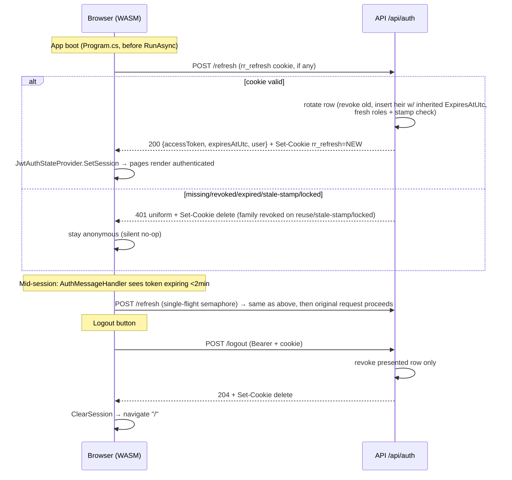

All context absorbed and verified against source: research report (R1–R9, risks 1–10, Q1–Q6), PROJECT-CONTEXT §4/§5/§7 (D-004…D-011), F0-blueprint B2/B4/B5/B6, [docs/api-conventions.md](docs/api-conventions.md), [AuthSetup.cs](src/RapidRelief.Api/Infrastructure/Auth/AuthSetup.cs), [FakeAuthHandler.cs](src/RapidRelief.Api/Infrastructure/Auth/FakeAuthHandler.cs), [AuthPolicies.cs](src/RapidRelief.Api/Infrastructure/Auth/AuthPolicies.cs), [SampleModule.cs](src/RapidRelief.Api/Features/Sample/SampleModule.cs), [SampleDbContext.cs](src/RapidRelief.Api/Features/Sample/Data/SampleDbContext.cs), [PingEndpoints.cs](src/RapidRelief.Api/Features/Sample/Endpoints/PingEndpoints.cs), [FakeUserAdminService.cs](src/RapidRelief.Api/Features/Stubs/FakeUserAdminService.cs), [TestingWebAppFactory.cs](tests/RapidRelief.Api.Tests/TestingWebAppFactory.cs), [ProductionAuthTests.cs](tests/RapidRelief.Api.Tests/Auth/ProductionAuthTests.cs), [LocalDiskFileStorage.cs](src/RapidRelief.Api/Infrastructure/Storage/LocalDiskFileStorage.cs), [Program.cs](src/RapidRelief.Api/Program.cs) (API), [Program.cs](src/RapidRelief.Client/Program.cs) (Client), [DevRoleHandler.cs](src/RapidRelief.Client/Common/Auth/DevRoleHandler.cs), [DevRolePicker.razor](src/RapidRelief.Client/Common/Auth/DevRolePicker.razor), [DevRoleState.cs](src/RapidRelief.Client/Common/Auth/DevRoleState.cs), [App.razor](src/RapidRelief.Client/App.razor), [MainLayout.razor](src/RapidRelief.Client/Layout/MainLayout.razor), [ci.yml](.github/workflows/ci.yml), [appsettings.json](src/RapidRelief.Api/appsettings.json), arch tests, plan F1/F13 cards.

---

# F1 — Authentication, Profiles & RBAC: Implementation Blueprint

## DECISIONS

Ready to paste into PROJECT-CONTEXT.md §7 (chunk B commits them; dates = merge date):

| ID | Date | Decision | Why |
|---|---|---|---|
| D-012 | 2026-09-01 | **Refresh cookie contract:** name `rr_refresh`, `HttpOnly`, `SameSite=Strict`, **`Path=/api/auth`** (Q1), `Secure` gated on **`!IsDevelopment() && !IsEnvironment("Testing")`**, `Expires` = the refresh row's `ExpiresAtUtc` (≤7d). CSRF posture = Strict cookie + JSON-body/Bearer endpoints; no antiforgery infrastructure. | `Path=/api/auth` lets `/logout` see the cookie (no raw token in body); Testing joins the Secure gate because `CookieContainer` silently drops `Secure` cookies over the factory's `http://localhost` (same condition as the existing D-010 HSTS gate); Dev stays plain-HTTP per D-010. |
| D-013 | 2026-09-01 | **Token lifetimes:** access JWT **30 min** (`Jwt:AccessTokenMinutes`), refresh **7 days absolute** (`Jwt:RefreshTokenDays`) — rotation **inherits** `ExpiresAtUtc` from the replaced row (no sliding); JwtBearer **`ClockSkew = 1 min`** (Q3). | R2/R9 recommendation; issuer and validator share one clock, so 5-min default skew only stretches the TTL; inheritance makes "absolute" true in one line. |
| D-014 | 2026-09-01 | **Server-side invalidation:** lock and role-change do **both** `UpdateSecurityStampAsync` **and** immediate revocation of all active refresh rows (Q2); refresh validates `SecurityStampAtIssue` against the live stamp; **reuse of a revoked token revokes the whole family** and publishes `AuthEvent("TokenReuse")`. | Lock/role change becomes effective at next refresh (worst case = 30-min access TTL); stamp check catches any revocation path missed; family revocation is the standard stolen-token response (R2/R6). |
| D-015 | 2026-09-01 | **Profile photo read path:** authenticated `GET /api/auth/profile/photo` streaming the caller's own photo via `IFileStorage.OpenReadAsync` (Q4). The blueprint-B4 "public upload serving" decision stays deferred to F2. | Zero new static-file surface; reuses hardened `LocalDiskFileStorage` traversal-safe read; photos are private-by-default. |
| D-016 | 2026-09-01 | **Registration policy:** `/register` is Citizen self-serve only — server hard-assigns `Citizen`, request carries no role field; NGO/Rescue/Admin accounts are provisioned by Admin promote via `PUT /api/auth/users/{id}/roles` (register-then-promote). F13's "NGO/volunteer self-registration" = a **future additive surface** (role request/approval consuming `IUserAdminService`), owned by F13, not built in F1 (Q5). | Kills the one-line privilege-escalation risk (research risk 9); standard practice for privileged roles; keeps F13's option open without contract changes. |
| D-017 | 2026-09-01 | **Fixed role GUIDs** (Q6), seeded in all environments: Citizen `aaaaaaaa-0000-0000-0000-000000000001`, Rescue `…0002`, Admin `…0003`, NGO `…0004` (constant map `AuthSeeder.RoleIds`, ordinal-matching `FakeAuthHandler.SeedUserIds`). | Deterministic role IDs across dev/CI/prod DBs simplify debugging, fixtures, and any future cross-env data move; costs nothing. |
| D-018 | 2026-09-01 | **PasswordHasher `IterationCount` = 210,000** (OWASP for PBKDF2-HMAC-SHA512), config knob `Auth:PasswordHasherIterations`; `TestingWebAppFactory` overrides to 10,000 for suite speed. | .NET 8 default is 100k (verified from source, R5); the V3 hash format embeds the per-hash count, so mixed counts verify correctly and old hashes auto-flag `SuccessRehashNeeded` — the override is safe. |
| D-019 | 2026-09-01 | **Auth wire DTOs are feature-local, NOT contracts:** server records in `RapidRelief.Api.Features.Auth.Endpoints`, hand-mirrored client records in `RapidRelief.Client.Features.Auth`. `Shared/Contracts` is untouched by F1 (existing `UserSummaryDto`/`AuthEvent`/`IUserAdminService` consumed as-is). | These DTOs are F1's own client↔server wire shapes, not cross-module surfaces (§6 registry definition); duplication is the price of the contract freeze (§4.6) and matches the "slice-local DTOs live beside their endpoints" convention. |

---

## BLUEPRINT

### 1. Packages (only delta; versions pinned like existing)

| Project | Add | Version |
|---|---|---|
| RapidRelief.Api | `Microsoft.AspNetCore.Identity.EntityFrameworkCore` | 8.0.30 |
| RapidRelief.Client | `Microsoft.AspNetCore.Components.Authorization` | 8.0.30 |

No client JWT library (manual payload parse), no new server JWT package (`JwtSecurityTokenHandler` flows via JwtBearer).

### 2. File tree

```
src/RapidRelief.Api/Features/Auth/
  AuthModule.cs                          # IFeatureModule, Name="Auth", Order=0 (default)
  Domain/AppUser.cs                      # : IdentityUser<Guid>
  Domain/RefreshToken.cs
  Data/AuthDbContext.cs                  # namespace RapidRelief.Api.Features.Auth.Data (arch-test rule)
  Data/Migrations/…                      # generated — see §11 command
  Endpoints/AuthDtos.cs                  # all request/response records + FluentValidation validators (D-019)
  Endpoints/AuthEndpoints.cs             # register/login/refresh/logout/profile/photo (8 endpoints)
  Endpoints/UserAdminEndpoints.cs        # users list / lock / roles (3 endpoints)
  Services/ITokenService.cs
  Services/TokenService.cs
  Services/IdentityUserAdminService.cs   # real IUserAdminService
  Seeding/AuthSeeder.cs                  # static SeedAsync + RoleIds map

src/RapidRelief.Client/
  Common/Auth/JwtAuthStateProvider.cs    # NEW
  Common/Auth/AuthMessageHandler.cs      # NEW
  Common/Auth/RedirectToLogin.razor      # NEW
  Common/Auth/LoginDisplay.razor         # NEW (top-row sign-in/out)
  Common/Auth/DevRolePicker.razor        # MODIFIED (disabled when signed in)
  Features/Auth/AuthClient.cs            # NEW — all auth HTTP calls
  Features/Auth/AuthModels.cs            # NEW — client mirrors of wire DTOs (D-019)
  Features/Auth/Pages/Login.razor        # @page "/login"
  Features/Auth/Pages/Register.razor     # @page "/register"
  Features/Auth/Pages/Profile.razor      # @page "/profile", [Authorize]
  App.razor                              # MODIFIED — AuthorizeRouteView
  Program.cs                             # MODIFIED — DI + handler chain + boot refresh
  Layout/MainLayout.razor                # MODIFIED — <LoginDisplay />
  _Imports.razor                         # MODIFIED — @using Microsoft.AspNetCore.Components.Authorization

src/RapidRelief.Api/Infrastructure/Auth/AuthSetup.cs   # MODIFIED — one line: ClockSkew (D-013)
src/RapidRelief.Api/appsettings.json                   # MODIFIED — Jwt TTLs + Auth section
src/RapidRelief.Api/appsettings.Development.json       # MODIFIED — dev-only Jwt:SigningKey (≥32 bytes)
tests/RapidRelief.Api.Tests/TestingWebAppFactory.cs    # MODIFIED — AuthDbContext + key + seeder
tests/RapidRelief.Api.Tests/Auth/                      # NEW test files (see TEST PLAN)
.github/workflows/ci.yml                               # MODIFIED — AuthDbContext fidelity line
docs/architecture/F1-blueprint.md                      # this document (committed in chunk B)
PROJECT-CONTEXT.md                                     # updated in BOTH chunks (mandatory)
```

`Features/Auth` references only itself, `Infrastructure/*`, and `Shared/Contracts` — same as Sample. (Features→Infrastructure is allowed; [ModuleIsolationTests.cs](tests/RapidRelief.Architecture.Tests/ModuleIsolationTests.cs) only forbids feature→feature and Infrastructure→feature.)

### 3. Entities

```csharp
// Domain/AppUser.cs — namespace RapidRelief.Api.Features.Auth.Domain
public sealed class AppUser : IdentityUser<Guid>
{
    public string DisplayName { get; set; } = string.Empty;   // required, max 100
    public string? EmergencyContact { get; set; }             // max 100
    public string? PhotoPath { get; set; }                    // max 260 — IFileStorage relative path
    // PhoneNumber inherited from IdentityUser
}

// Domain/RefreshToken.cs
public sealed class RefreshToken
{
    public Guid Id { get; set; }                       // PK, client-generated Guid.NewGuid()
    public Guid UserId { get; set; }                   // FK → auth_users (same module: FK allowed), no navigation property
    public string TokenHash { get; set; } = "";        // required, max 64 — Base64(SHA-256(raw)), 44 chars
    public string SecurityStampAtIssue { get; set; } = ""; // required, max 64
    public DateTimeOffset CreatedAtUtc { get; set; }
    public DateTimeOffset ExpiresAtUtc { get; set; }   // absolute — inherited on rotation (D-013)
    public DateTimeOffset? RevokedAtUtc { get; set; }  // null = active
    public string? ReplacedByTokenHash { get; set; }   // max 64
}
```

Constraints/indexes (in `OnModelCreating`): unique index on `TokenHash`; non-unique index on `UserId`; FK `UserId → auth_users.Id` (`HasOne<AppUser>().WithMany().HasForeignKey(t => t.UserId)`, cascade delete). **SQLite ticks gate** (copy [SampleDbContext.cs](src/RapidRelief.Api/Features/Sample/Data/SampleDbContext.cs#L31-L40) pattern) on `CreatedAtUtc`, `ExpiresAtUtc`, `RevokedAtUtc` — all three appear in SQL `WHERE`; the nullable one uses the same converter (EF wraps nulls automatically). Identity's own `LockoutEnd` is **not** gated — and must therefore never be compared inside a SQL query (see §8).

### 4. AuthDbContext skeleton

```csharp
// Data/AuthDbContext.cs — namespace RapidRelief.Api.Features.Auth.Data
public sealed class AuthDbContext : IdentityDbContext<AppUser, IdentityRole<Guid>, Guid>
{
    public const string MigrationsHistoryTableName = "__efmigrationshistory_auth";

    public AuthDbContext(DbContextOptions<AuthDbContext> options) : base(options) { }

    public DbSet<RefreshToken> RefreshTokens => Set<RefreshToken>();

    protected override void OnModelCreating(ModelBuilder b)
    {
        base.OnModelCreating(b);                                  // MUST be first (research risk 2)
        b.Entity<AppUser>(u => {
            u.ToTable("auth_users");
            u.Property(x => x.DisplayName).IsRequired().HasMaxLength(100);
            u.Property(x => x.EmergencyContact).HasMaxLength(100);
            u.Property(x => x.PhotoPath).HasMaxLength(260);
        });
        b.Entity<IdentityRole<Guid>>().ToTable("auth_roles");
        b.Entity<IdentityUserRole<Guid>>().ToTable("auth_user_roles");
        b.Entity<IdentityUserClaim<Guid>>().ToTable("auth_user_claims");
        b.Entity<IdentityUserLogin<Guid>>().ToTable("auth_user_logins");
        b.Entity<IdentityUserToken<Guid>>().ToTable("auth_user_tokens");
        b.Entity<IdentityRoleClaim<Guid>>().ToTable("auth_role_claims");
        b.Entity<RefreshToken>(t => {
            t.ToTable("auth_refresh_tokens");
            t.HasKey(x => x.Id);
            t.Property(x => x.TokenHash).IsRequired().HasMaxLength(64);
            t.Property(x => x.SecurityStampAtIssue).IsRequired().HasMaxLength(64);
            t.Property(x => x.ReplacedByTokenHash).HasMaxLength(64);
            t.HasIndex(x => x.TokenHash).IsUnique();
            t.HasIndex(x => x.UserId);
            t.HasOne<AppUser>().WithMany().HasForeignKey(x => x.UserId).OnDelete(DeleteBehavior.Cascade);
            if (Database.ProviderName == "Microsoft.EntityFrameworkCore.Sqlite")
            {
                // ticks conversions for CreatedAtUtc / ExpiresAtUtc / RevokedAtUtc (Sample pattern)
            }
        });
    }
}
```

### 5. Token service spec

```csharp
// Services/ITokenService.cs — namespace RapidRelief.Api.Features.Auth.Services
public interface ITokenService
{
    (string AccessToken, DateTimeOffset ExpiresAtUtc) CreateAccessToken(AppUser user, IReadOnlyList<string> roles);
    Task<string> IssueRefreshTokenAsync(AppUser user, DateTimeOffset? inheritedAbsoluteExpiry, CancellationToken ct); // returns RAW token
    Task<RefreshOutcome> ValidateAndRotateAsync(string rawToken, CancellationToken ct);
    Task RevokeAsync(string rawToken, CancellationToken ct);            // logout: revoke that row only, idempotent
    Task RevokeAllForUserAsync(Guid userId, CancellationToken ct);      // admin lock / role change (D-014)
}
public sealed record RefreshOutcome(bool Succeeded, string? AccessToken, DateTimeOffset? AccessExpiresAtUtc,
    string? NewRawRefreshToken, DateTimeOffset? RefreshExpiresAtUtc, AppUser? User, IReadOnlyList<string>? Roles,
    string? FailureReason);   // FailureReason feeds logs/AuthEvent only — the HTTP response is always uniform 401
```

Implementation rules (`TokenService`, deps: `AuthDbContext`, `UserManager<AppUser>`, `IConfiguration`, `TimeProvider`, `IEventBus`):

- **Access JWT (R9):** `JwtSecurityTokenHandler` with default claim maps (**never** `MapInboundClaims = false`). Claims minted with `ClaimTypes.NameIdentifier` = `user.Id`, `ClaimTypes.Name` = `user.Email`, one `ClaimTypes.Role` per role, plus `JwtRegisteredClaimNames.Jti` = new Guid. Signing: `SymmetricSecurityKey(UTF8(Jwt:SigningKey))`, HmacSha256; `iss`/`aud` from `Jwt:Issuer|Audience`; `exp` = now + `Jwt:AccessTokenMinutes` (default 30). Round-trip through JwtBearer's inbound map restores `ClaimTypes.*` — principal identical to [FakeAuthHandler.cs](src/RapidRelief.Api/Infrastructure/Auth/FakeAuthHandler.cs#L47-L52)'s, so [AuthPolicies.cs](src/RapidRelief.Api/Infrastructure/Auth/AuthPolicies.cs) works unchanged. No security-stamp claim (D-014 uses the row check).
- **Raw refresh token:** `RandomNumberGenerator.GetBytes(32)` → `WebEncoders.Base64UrlEncode`. **At rest:** `Convert.ToBase64String(SHA256.HashData(Encoding.UTF8.GetBytes(raw)))` → `TokenHash`. Lookup is by exact hash via the unique index (no constant-time comparison needed).
- **Issue:** row = `{ Id=NewGuid, UserId, TokenHash, SecurityStampAtIssue = user.SecurityStamp!, CreatedAtUtc = now, ExpiresAtUtc = inheritedAbsoluteExpiry ?? now + Jwt:RefreshTokenDays(7d) }`. Login/register pass `null` (new family); rotation passes the old row's `ExpiresAtUtc` (D-013).
- **`ValidateAndRotateAsync(raw)`** — single `SaveChangesAsync` at the end:
  1. Hash → load row by `TokenHash`. Missing → fail `"Unknown"`.
  2. `RevokedAtUtc != null` → **reuse**: set `RevokedAtUtc = now` on all active rows of `row.UserId`, publish `AuthEvent(row.UserId, "TokenReuse", null)`, fail `"Reuse"`.
  3. `ExpiresAtUtc <= now` → fail `"Expired"`.
  4. Load user via `UserManager.FindByIdAsync`. Missing → fail `"NoUser"`. `IsLockedOutAsync` → revoke-all + fail `"LockedOut"`.
  5. `user.SecurityStamp != row.SecurityStampAtIssue` → revoke-all + fail `"StaleStamp"`.
  6. Success: `row.RevokedAtUtc = now`, `row.ReplacedByTokenHash = newHash`; insert replacement row with **inherited** `ExpiresAtUtc` and **current** `user.SecurityStamp`; mint access token with **fresh** `GetRolesAsync` roles.
- **Revoke-all:** load active rows (`UserId == id && RevokedAtUtc == null`), set `RevokedAtUtc = now`, save. Load-then-update, **not** `ExecuteUpdateAsync` — provider-portable with the ticks converter, and rows-per-user is tiny.
- All timestamps from `TimeProvider.GetUtcNow()` (D-009 precedent; `AuthModule` does `TryAddSingleton(TimeProvider.System)`).

### 6. Endpoint specs — 11 endpoints, all `/api/auth` group

Conventions apply everywhere: explicit FluentValidation in-endpoint, `ApiEnvelope<T>` success, ProblemDetails errors, **`DatabaseHealth` gate first** → 503 `DatabaseUnavailable()` exactly like [PingEndpoints.cs](src/RapidRelief.Api/Features/Sample/Endpoints/PingEndpoints.cs#L120-L126) (all 11 are DB-backed; FakeAuth keeps the demo alive in degraded mode).

| # | Endpoint | Auth | Rate limit | Request → Response |
|---|---|---|---|---|
| 1 | `POST /register` | `AllowAnonymous` | `RequireRateLimiting("auth")` | `RegisterRequest` → 201 + `ApiEnvelope<AuthSessionDto>` + cookie (auto-login), `Location: /api/auth/profile` |
| 2 | `POST /login` | `AllowAnonymous` | `RequireRateLimiting("auth")` | `LoginRequest` → 200 + `ApiEnvelope<AuthSessionDto>` + cookie |
| 3 | `POST /refresh` | `AllowAnonymous` | `RequireRateLimiting("auth")` | cookie only → 200 + `ApiEnvelope<AuthSessionDto>` + rotated cookie |
| 4 | `POST /logout` | `RequireAuthorization()` | global | cookie → 204 + cookie delete (idempotent: missing/revoked row still 204) |
| 5 | `GET /profile` | `RequireAuthorization()` | global | → 200 `ApiEnvelope<UserProfileDto>` (caller's own, id from `ClaimTypes.NameIdentifier`) |
| 6 | `PUT /profile` | `RequireAuthorization()` | global | `UpdateProfileRequest` → 200 `ApiEnvelope<UserProfileDto>` (email immutable in F1) |
| 7 | `POST /profile/photo` | `RequireAuthorization()` | global | multipart `IFormFile file` → 200 `ApiEnvelope<UserProfileDto>`; **`.DisableAntiforgery()`** (Bearer auth ⇒ CSRF n/a; without it .NET 8 form-binding throws at startup); `ArgumentException` from `IFileStorage.SaveAsync` → 400 ValidationProblem (`file` key); replaces: save new → set `PhotoPath` → best-effort `DeleteAsync(old)` |
| 8 | `GET /profile/photo` | `RequireAuthorization()` | global | → 200 stream (`IFileStorage.OpenReadAsync(user.PhotoPath)`, content type via `FileExtensionContentTypeProvider`, fallback `application/octet-stream`); no photo/missing file → 404 ProblemDetails (D-015) |
| 9 | `GET /users?page=&pageSize=` | `AuthPolicies.RequireAdmin` | global | → 200 `ApiEnvelope<PagedResult<UserSummaryDto>>` (service clamps too) |
| 10 | `POST /users/{id:guid}/lock` | `AuthPolicies.RequireAdmin` | global | `SetLockRequest(bool Locked)` → 204; unknown id → 404 ProblemDetails; `id == caller` → 400 ("Cannot lock your own account") |
| 11 | `PUT /users/{id:guid}/roles` | `AuthPolicies.RequireAdmin` | global | `SetRolesRequest(IReadOnlyList<string> Roles)` → 204; unknown id → 404; `id == caller` → 400 ("Cannot change your own roles") |

**DTOs + validation** (all in `Endpoints/AuthDtos.cs`, namespace `RapidRelief.Api.Features.Auth.Endpoints` — D-019):

```csharp
public sealed record RegisterRequest(string? Email, string? Password, string? DisplayName,
    string? PhoneNumber, string? EmergencyContact);          // NO role field — ever (D-016)
public sealed record LoginRequest(string? Email, string? Password);
public sealed record UpdateProfileRequest(string? DisplayName, string? PhoneNumber, string? EmergencyContact);
public sealed record SetLockRequest(bool Locked);
public sealed record SetRolesRequest(IReadOnlyList<string>? Roles);
public sealed record UserProfileDto(Guid Id, string Email, string DisplayName, string? PhoneNumber,
    string? EmergencyContact, bool HasPhoto, IReadOnlyList<string> Roles);
public sealed record AuthSessionDto(string AccessToken, DateTimeOffset ExpiresAtUtc, UserProfileDto User);
```

Validators: `RegisterRequestValidator` — Email NotEmpty, EmailAddress, ≤256; Password NotEmpty, ≤128 (complexity is Identity's job); DisplayName NotEmpty ≤100; PhoneNumber ≤20; EmergencyContact ≤100. `LoginRequestValidator` — Email NotEmpty ≤256, Password NotEmpty ≤128 (**validate before any DB touch** — the rate-limit pin test depends on this fast path). `UpdateProfileRequestValidator` — DisplayName NotEmpty ≤100, others as register. `SetRolesRequestValidator` — Roles NotEmpty, every entry ∈ `Roles.All` (ordinal, case-sensitive — research risk 10).

**Error semantics:**
- **Register:** `UserManager.CreateAsync` failure → `Results.ValidationProblem` with dictionary keyed by `IdentityResult.Errors[].Code` → `[Description]` (e.g. `"DuplicateUserName": […]`) — the `MapIdentityApi` shape. Duplicate-email disclosure here is accepted (industry parity; mitigated by the `auth` rate limit).
- **Login/refresh: uniform 401** — identical ProblemDetails (`title: "Invalid credentials."`, no detail) for unknown email, wrong password, locked account, and every refresh failure reason. Reasons go to `AuthEvent`/logs only. Login flow: validate shape → 503-gate → `FindByEmailAsync` (null → 401) → `SignInManager.CheckPasswordSignInAsync(user, pwd, lockoutOnFailure: true)` (defaults: 5 attempts/5-min lockout) → not succeeded → 401.
- **Refresh failure additionally deletes the cookie** (prevents client refresh loops).
- **Cookie set/clear helper (D-012):** `Append("rr_refresh", raw, new CookieOptions { HttpOnly = true, SameSite = SameSiteMode.Strict, Path = "/api/auth", Secure = <!Dev && !Testing>, Expires = refreshRowExpiresAtUtc })`; delete with **identical Path/attributes** or browsers won't match.

**AuthEvents published** (via `IEventBus`; zero handlers today = silent success): `Register`, `Login`, `LoginFailed` (details = reason, `Guid.Empty` for unknown email; never the password), `Logout`, `TokenReuse`, `Lock`, `Unlock`, `RoleChange` (details = new role csv).

### 7. Refresh flow sequence



Accepted limitation (record in risks): two tabs refreshing the same cookie concurrently can trip reuse detection → whole family revoked → both tabs re-login. Boot-refresh + single-flight makes this rare; worst case is one extra login.

### 8. `IdentityUserAdminService` (real `IUserAdminService`)

Registered `services.AddScoped<IUserAdminService, IdentityUserAdminService>()` in `AuthModule` — plain `AddScoped` displaces [FakeUserAdminService.cs](src/RapidRelief.Api/Features/Stubs/FakeUserAdminService.cs) automatically via StubsModule's `TryAdd` stub-yield (B5). Contract is frozen — the service adapts to it exactly.

- **`GetUsersAsync(page, pageSize)`**: clamp page 1–1,000,000 / pageSize 1–200 **before math**; query `Users.OrderBy(u => u.Email).ThenBy(u => u.Id)`, `Skip/Take`, materialize the page; then **one** roles query for the page's user ids (join `UserRoles`×`Roles`, group in memory — no N+1); **`IsLocked` computed in memory** after materialization (`LockoutEnd.HasValue && LockoutEnd > now`) — `LockoutEnd` is not ticks-gated, comparing it in SQL breaks SQLite. `TotalCount` = full `Users.CountAsync()`.
- **`SetLockedAsync(id, locked)`**: `FindByIdAsync` → null ⇒ `false`. Lock: `SetLockoutEnabledAsync(user, true)` + `SetLockoutEndDateAsync(user, DateTimeOffset.MaxValue)`; unlock: `SetLockoutEndDateAsync(user, null)` + `ResetAccessFailedCountAsync`. Both paths: `UpdateSecurityStampAsync(user)`. **Lock only:** `ITokenService.RevokeAllForUserAsync` (D-014). Publish `AuthEvent(id, locked ? "Lock" : "Unlock", null)`. Return `true`.
- **`SetRolesAsync(id, roles)`**: unknown user ⇒ `false` (fake-parity semantics). Roles validated against `Roles.All` (ordinal) — invalid ⇒ `ArgumentException` (endpoint's validator prevents reaching it; the service check is the security backstop per research risk 7). Apply diff: `RemoveFromRolesAsync(current.Except(target))` + `AddToRolesAsync(target.Except(current))` → `UpdateSecurityStampAsync` → `RevokeAllForUserAsync` → `AuthEvent(id, "RoleChange", csv)` → `true`.

### 9. AuthSeeder

`Seeding/AuthSeeder.cs` — `public static class AuthSeeder`, `public static async Task SeedAsync(IServiceProvider scopedServices, CancellationToken ct)`. Resolves `RoleManager<IdentityRole<Guid>>`, `UserManager<AppUser>`, `IHostEnvironment`.

- **Roles — all environments**, fixed GUIDs (D-017): per role in `Roles.All`: `RoleExistsAsync(role)` → false ⇒ `CreateAsync(new IdentityRole<Guid>(role) { Id = RoleIds[role] })`. `public static readonly IReadOnlyDictionary<string, Guid> RoleIds` with the D-017 values. Role names exactly the `Roles` constants (`"NGO"`, not `"Ngo"` — risk 10).
- **Demo users — Development OR Testing only** (Testing needs them for login tests; the research's "Dev only" intent is "never Production/Staging"): per role: `FindByEmailAsync($"{role.ToLowerInvariant()}1@rr.dev")` → null ⇒ `new AppUser { Id = FakeAuthHandler.SeedUserIds[role], UserName = email, Email = email, EmailConfirmed = true, DisplayName = $"{role} One" }` → `CreateAsync(user, "Demo!123")` → `AddToRoleAsync(user, role)`. Explicit non-empty `Id` suppresses EF's Guid autogeneration; GUIDs + `DisplayName` match [FakeAuthHandler.cs](src/RapidRelief.Api/Infrastructure/Auth/FakeAuthHandler.cs#L19-L26) and the fake admin service.
- **Idempotent** by the two exists-checks; safe to run every boot.
- **Invoked from both**: `AuthModule.MigrateAsync` (after `Database.MigrateAsync`) and `TestingWebAppFactory.CreateHost` (after `EnsureCreated<AuthDbContext>` — MigrationRunner never runs in Testing, research R5 catch). Seeder failure inside `MigrateAsync` is swallowed by MigrationRunner's retry/warn (D-005) — Production factories with no DB stay boot-safe.
- Iteration count is *not* the seeder's concern — it flows from DI `PasswordHasherOptions` (D-018), so seeded and registered users hash identically per environment.

### 10. AuthModule

```csharp
public sealed class AuthModule : IFeatureModule   // Name = "Auth", default Order 0
{
    public void AddModule(IServiceCollection services, IConfiguration config, IHostEnvironment env)
    {
        if (!env.IsEnvironment("Testing"))                    // factory injects SQLite itself (B6 step 8)
            services.AddDbContext<AuthDbContext>(o => o.UseNpgsql(config.GetConnectionString("Postgres"),
                n => n.MigrationsHistoryTable(AuthDbContext.MigrationsHistoryTableName)));

        services.AddIdentityCore<AppUser>(o =>                // NEVER AddIdentity (research risk 1)
            {
                o.User.RequireUniqueEmail = true;
                // password + lockout stay at Identity defaults (≥6, upper/lower/digit/symbol; 5 tries/5 min)
            })
            .AddRoles<IdentityRole<Guid>>()
            .AddEntityFrameworkStores<AuthDbContext>()
            .AddSignInManager();                               // no AddDefaultTokenProviders (R1)

        services.AddHttpContextAccessor();                     // SignInManager dependency
        services.Configure<PasswordHasherOptions>(o =>
            o.IterationCount = config.GetValue("Auth:PasswordHasherIterations", 210_000));   // D-018
        services.TryAddSingleton(TimeProvider.System);         // D-009 precedent
        services.AddScoped<ITokenService, TokenService>();
        services.AddScoped<IUserAdminService, IdentityUserAdminService>();   // displaces the fake (B5)
    }
    public void MapEndpoints(IEndpointRouteBuilder e) { AuthEndpoints.Map(e); UserAdminEndpoints.Map(e); }
    public async Task MigrateAsync(IServiceProvider sp, CancellationToken ct)
    {
        await sp.GetRequiredService<AuthDbContext>().Database.MigrateAsync(ct);
        await AuthSeeder.SeedAsync(sp, ct);
    }
}
```

### 11. Config, infrastructure edit, migration command, CI

- [AuthSetup.cs](src/RapidRelief.Api/Infrastructure/Auth/AuthSetup.cs) — **single line added** to `TokenValidationParameters`: `ClockSkew = TimeSpan.FromMinutes(1)` (D-013). No other Program.cs/API changes — rate limiting is applied per-endpoint in the module (the `"auth"` policy already exists in [Program.cs](src/RapidRelief.Api/Program.cs#L76-L84); F1 wires the call sites, mandatory per D-011).
- [appsettings.json](src/RapidRelief.Api/appsettings.json): `Jwt` gains `"AccessTokenMinutes": 30, "RefreshTokenDays": 7`; new section `"Auth": { "PasswordHasherIterations": 210000 }`.
- appsettings.Development.json: add `"Jwt": { "SigningKey": "<committed dev-only key, ≥32 bytes, clearly labeled not-a-secret>" }` — without it, Development login mints with an empty key and throws. The fail-fast guard (non-Dev/Testing) is untouched.
- **Migration:** `dotnet ef migrations add Initial --project src/RapidRelief.Api --context AuthDbContext --output-dir Features/Auth/Data/Migrations`.
- **CI:** add to the `postgres-fidelity` job (after the Sample line): `dotnet ef database update --project src/RapidRelief.Api --context AuthDbContext` with the same env — proves the migration is valid Npgsql SQL.
- **TestingWebAppFactory:** `AddSqliteContext<AuthDbContext>(services)`; `builder.UseSetting("Jwt:SigningKey", new string('t', 64))` (Testing mints/validates real JWTs); `builder.UseSetting("Auth:PasswordHasherIterations", "10000")`; in `CreateHost`: `EnsureCreated<AuthDbContext>(host)` then seed via a scope (`AuthSeeder.SeedAsync(scope.ServiceProvider, default).GetAwaiter().GetResult()`).

### 12. Client specification

**`JwtAuthStateProvider`** (singleton; also registered as `AuthenticationStateProvider`): holds `ClaimsPrincipal _user` (anonymous default), `string? AccessToken`, `DateTimeOffset ExpiresAtUtc`. `SetSession(token, expiresAtUtc)` parses and notifies; `ClearSession()` resets and notifies. **Parse:** split `'.'`, take `[1]`, Base64Url-decode (restore padding), `JsonDocument`: userId = `"nameid"` ?? `"sub"` → `ClaimTypes.NameIdentifier`; `"unique_name"` → `ClaimTypes.Name`; `"role"` (string **or** array) → `ClaimTypes.Role` each (covers both outbound-map spellings). Identity created with `authenticationType: "jwt"` (non-null ⇒ `IsAuthenticated`).

**`AuthMessageHandler`** (chained **after** `DevRoleHandler`, i.e. inner): same-origin guard identical to [DevRoleHandler.cs](src/RapidRelief.Client/Common/Auth/DevRoleHandler.cs#L31-L41) (Bearer must never leak to tile servers). When `AccessToken` present and target same-origin: (1) if `ExpiresAtUtc - now < 2 min` and the request is not itself `/api/auth/refresh` → single-flight (static `SemaphoreSlim(1,1)`) proactive refresh: build a fresh `POST /api/auth/refresh` `HttpRequestMessage`, send via `base.SendAsync`, on 200 parse `data.accessToken`/`expiresAtUtc` with `JsonDocument` → `SetSession`; on failure → `ClearSession`. No retry/cloning of the original request — it is sent exactly once, after. (2) Set `Authorization: Bearer <token>` and **`request.Headers.Remove("X-Dev-Role")`** — real login wins (R4).

**`AuthClient`** (scoped; uses the app `HttpClient`): `RegisterAsync`, `LoginAsync` (→ `SetSession`, return validation errors for display), `TryBootRefreshAsync` (POST refresh; swallow **all** failures incl. network — offline PWA boot must not crash; 5-s `CancellationTokenSource` cap), `LogoutAsync` (POST logout, ignore failures, always `ClearSession`), `GetProfileAsync`, `UpdateProfileAsync`, `UploadPhotoAsync` (`MultipartFormDataContent`, field name `file`), `GetProfilePhotoDataUrlAsync` — fetches bytes via HttpClient and returns a base64 data URL, because **an `` tag cannot send a Bearer header** (D-015 read path is authenticated).

**Client Program.cs** ([Program.cs](src/RapidRelief.Client/Program.cs)):

```csharp
builder.Services.AddSingleton<DevRoleState>();
builder.Services.AddSingleton<JwtAuthStateProvider>();
builder.Services.AddSingleton<AuthenticationStateProvider>(sp => sp.GetRequiredService<JwtAuthStateProvider>());
builder.Services.AddAuthorizationCore();
builder.Services.AddCascadingAuthenticationState();          // .NET 8 replacement for the wrapper component
builder.Services.AddScoped<AuthClient>();
// chain: DevRoleHandler (outer) → AuthMessageHandler (inner, strips X-Dev-Role when token present) → HttpClientHandler
builder.Services.AddScoped(sp => new HttpClient(
    new DevRoleHandler(sp.GetRequiredService<DevRoleState>(), baseAddress)
    { InnerHandler = new AuthMessageHandler(sp.GetRequiredService<JwtAuthStateProvider>(), baseAddress)
      { InnerHandler = new HttpClientHandler() } })
    { BaseAddress = baseAddress });

var host = builder.Build();
await host.Services.GetRequiredService<AuthClient>().TryBootRefreshAsync();   // F5 session restore (R3)
await host.RunAsync();
```

Same-origin cookie note: WASM `HttpClient` defaults to `same-origin` credentials — the hosted app needs no `SetBrowserRequestCredentials` call.

**App.razor:** swap `RouteView` → `AuthorizeRouteView`; `<NotAuthorized>`: if `!context.User.Identity!.IsAuthenticated` → `<RedirectToLogin />` (navigates `/login?returnUrl={Uri.EscapeDataString(current)}`), else "Not authorized" text. Existing pages stay attribute-free — **client route protection keys off real JWT sessions only; X-Dev-Role never unlocks client pages** (it remains an API-level dev tool, so teammates are unaffected — F1 DoD).

**Pages** (all use `EditForm` + `DataAnnotationsValidator`-free manual binding or FluentValidation-style manual checks — display server `ValidationProblem` errors per-field from the 400 payload; keep it simple, server is the authority):
- **Login.razor** (`/login`): email+password form; on success → navigate `returnUrl ?? "/"`; on 401 → single generic "Invalid credentials." banner; link to register. If already authenticated → immediate redirect home.
- **Register.razor** (`/register`): email/password/display name/phone/emergency contact; field-level errors from the 400 dictionary (incl. Identity codes); success = auto-login → home.
- **Profile.razor** (`/profile`, `@attribute [Authorize]`): loads `GET /profile`; edit form for DisplayName/Phone/EmergencyContact (email shown read-only); photo section: current photo via data URL, `InputFile` (client pre-check: extension ∈ jpg/jpeg/png/webp, ≤10 MiB — server still authoritative), upload button; logout button.
- **LoginDisplay.razor** in [MainLayout.razor](src/RapidRelief.Client/Layout/MainLayout.razor) top row: `AuthorizeView` — Authorized: display name + Profile link + Sign out (calls `AuthClient.LogoutAsync` → navigate `/`); NotAuthorized: Login/Register links.
- **DevRolePicker.razor:** wrap in `AuthorizeView` — when Authorized render the select `disabled` with title "Signed in as {name} — dev role inactive"; NotAuthorized keeps current behavior. (`AuthMessageHandler` stripping is the enforcement; this is UX truth-telling.)
- PWA service worker: no change — it is asset-only; verify it stays that way (research risk 8).

---

## IMPLEMENTATION CHUNKS

### Chunk A — Server slice (independently green)

Scope: Api package add; `Features/Auth/*` (entities, `AuthDbContext`, migration, `TokenService`, all 11 endpoints, `IdentityUserAdminService`, `AuthSeeder`, `AuthModule`); `AuthSetup` ClockSkew line; appsettings + appsettings.Development key; `TestingWebAppFactory` additions; CI postgres-fidelity line; all server tests; PROJECT-CONTEXT update (F1 → IN PROGRESS + changelog; decisions land in B with the blueprint doc, or here if preferred — never skipped).

Verify:

```powershell
dotnet build -c Release                     # 0 warnings (TreatWarningsAsErrors), 0 errors
dotnet test -c Release                      # 94 existing + all new green (incl. arch tests auto-covering AuthDbContext placement)
dotnet ef migrations list --project src/RapidRelief.Api --context AuthDbContext    # shows Initial
dotnet ef migrations list --project src/RapidRelief.Api --context SampleDbContext  # unchanged
dotnet run --project src/RapidRelief.Api    # NO Postgres running — degraded smoke:
#   GET /health                → 200 "degraded", dbConnected=false
#   POST /api/auth/login       → 503 ProblemDetails (DatabaseUnavailable, D-005)
#   GET /api/foundation/whoami + X-Dev-Role: Admin → 200 (FakeAuth alive)
#   GET /sample                → SPA serves
```

(Postgres fidelity for the new migration is proven by CI only — no local Postgres per constraints.)

### Chunk B — Client + docs/bookkeeping

Scope: Client package add; `JwtAuthStateProvider`/`AuthMessageHandler`/`AuthClient`/models; Login/Register/Profile pages; `RedirectToLogin`/`LoginDisplay`; App.razor/`_Imports`/MainLayout/DevRolePicker/Program.cs edits; `docs/architecture/F1-blueprint.md`; PROJECT-CONTEXT final update (status → MVP DONE/DONE, changelog, decisions D-012…D-019, §2 CI row note; §6 explicitly unchanged).

Verify:

```powershell
dotnet build -c Release && dotnet test -c Release        # everything still green
dotnet run --project src/RapidRelief.Api                 # WITH docker compose up -d (or degraded — pages must still render)
# Browser flow checklist:
#   /register → new account → lands home signed in (LoginDisplay shows name; DevRolePicker disabled)
#   /profile → edit fields → save → reload → persisted; photo upload (png) → renders; .txt → field error
#   F5 anywhere → session survives (boot refresh)
#   Sign out → anonymous; /profile → redirected to /login?returnUrl=/profile; login → back to /profile
#   Signed out + DevRolePicker=Admin → /sample ping post still works (FakeAuth untouched)
dotnet publish src/RapidRelief.Api -c Release             # 0 warnings; artifact serves /login SPA route
```

---

## TEST PLAN

All integration tests through `TestingWebAppFactory` (SQLite, seeded, real MultiAuth→JwtBearer) unless noted. New files under tests/RapidRelief.Api.Tests/Auth/: `RegisterTests`, `LoginTests`, `RefreshTests`, `ProfileTests`, `UserAdminTests`, `SeederTests`, `RateLimitPinTests` (own factory).

1. **Register happy**: 201, envelope `AuthSessionDto`, roles == `["Citizen"]`, `Set-Cookie: rr_refresh` with `httponly`, `samesite=strict`, `path=/api/auth`, no `secure` (Testing).
2. **Role injection**: register body with extra `"roles": ["Admin"]`/`"role": "Admin"` JSON → 201, roles still exactly `["Citizen"]`.
3. **Duplicate email** → 400 ValidationProblem containing an Identity `Duplicate*` code key.
4. **Weak password** → 400 with Identity password error codes; **bad shape** (empty email/display name) → 400 FluentValidation keys.
5. **Login happy**: 200; token authenticates `GET /api/foundation/whoami` → NameIdentifier == `33333333-…` (admin seed), Name == `admin1@rr.dev`, Roles == `["Admin"]` — **claims-parity pin vs FakeAuth** (call whoami both ways, assert identical triples).
6. **Enumeration uniformity**: unknown email vs wrong password vs locked user → three 401s with **byte-identical** ProblemDetails bodies.
7. **Lockout accounting**: 5 wrong passwords then the correct one → still 401 (uniform); after lockout window logic not simulated (no clock travel) — assert via 6th-attempt-correct-password 401 only.
8. **Refresh happy**: login → refresh → 200, new access token works, `Set-Cookie` value differs (rotation), old row revoked + `ReplacedByTokenHash` set (assert via scoped `AuthDbContext`).
9. **Absolute expiry inheritance**: after rotation, heir row `ExpiresAtUtc` == original row's (DB assert).
10. **Reuse-detection family revocation**: login → refresh (cookie N2) → replay N1 → 401; then N2 → 401 (family dead); optional: registered test `IEventHandler<AuthEvent>` observed `TokenReuse`.
11. **Stamp mismatch**: login → `UserManager.UpdateSecurityStampAsync` via scope → refresh → 401.
12. **Lock invalidation**: citizen logs in → admin `POST /users/{id}/lock {locked:true}` → citizen refresh → 401 AND re-login → 401 (uniform); unlock → login succeeds again.
13. **Role-change invalidation**: citizen logs in → admin `PUT /users/{id}/roles ["Rescue"]` → old refresh 401; fresh login token carries `Rescue` only.
14. **Roles validation**: `PUT /users/{id}/roles ["SuperAdmin"]` → 400; empty list → 400; `PUT` on own id (admin) → 400; unknown user id → 404.
15. **Lock guard**: admin locking own id → 400.
16. **Users paging**: seed guarantees 4 users; `?page=0&pageSize=99999` → clamped echo (page=1, pageSize=200), items contain roles + `IsLocked`; Citizen token → 403; anonymous → 401 (policy pins).
17. **Logout**: 204, cookie deleted (expired `Set-Cookie`), subsequent refresh → 401; repeat logout → 204 (idempotent).
18. **Profile**: GET returns own data; PUT updates the three mutable fields, email unchanged; PUT invalid → 400.
19. **Photo**: PNG upload → 200 `HasPhoto=true`; `GET /profile/photo` → 200 `image/png`, bytes round-trip; `.exe` → 400; >10 MiB stream → 400; GET with no photo → 404. (Optionally point `FileStorage:Root` at a temp dir via factory setting.)
20. **Expired-token rejection (ClockSkew pin)**: hand-mint a JWT with the Testing key and `exp = now − 2 min` → whoami → 401 (proves lifetime + 1-min skew).
21. **Rate-limit pin** (non-Testing factory): `UseEnvironment("Development")` + `UseSetting("RateLimiting:Auth:PermitLimit","2")` → three `POST /api/auth/login` with invalid bodies (fast 400 path, no DB) → 400, 400, **429**. (Boot tolerates MigrationRunner degraded retries — empty conn string fails fast.)
22. **Production pins stay green**: existing [ProductionAuthTests.cs](tests/RapidRelief.Api.Tests/Auth/ProductionAuthTests.cs) unchanged — X-Dev-Role → 401 in Production, signing-key fail-fast (boot now also exercises AuthModule migrate/seed failure-tolerance, D-005).
23. **Seeder idempotency**: run `SeedAsync` again via scope → user/role counts unchanged, no exception.
24. **Stub-yield displacement**: resolve `IUserAdminService` from the host → `IdentityUserAdminService` (not the fake).
25. **Architecture tests** (auto-cover, no edits): `AuthDbContext` ∈ `Features.Auth.Data`; `Features.Auth` no cross-feature deps; contracts purity untouched.
26. **Existing 94 tests stay green** — especially FakeAuth tests (MultiAuth untouched) and Sample slice.

---

## DOD CHECKLIST

- [ ] All 11 endpoints live with exact policies + `RequireRateLimiting("auth")` on register/login/refresh (D-011 satisfied).
- [ ] `Shared/Contracts` diff is **empty** (D-019); fake user admin service still compiles and yields via `TryAdd`.
- [ ] FakeAuth + DevRolePicker + degraded mode all still work (§4.5): whoami via X-Dev-Role, auth endpoints 503 without DB, app boots with no Postgres.
- [ ] Seeded users login with `Demo!123` in Dev/Testing; roles exist in every environment with D-017 GUIDs; no demo users outside Dev/Testing.
- [ ] Full test plan green; build + publish 0 warnings; CI postgres-fidelity applies `AuthDbContext` Initial.
- [ ] Boot-time silent refresh restores session on F5; logout kills it server-side (row revoked, not just client state).
- [ ] PROJECT-CONTEXT.md updated in each chunk: F1 status row, changelog entries, decisions D-012…D-019 appended, §2 row (CI/contexts) refreshed, §6 confirmed unchanged. **Code without this is unmergeable.**
- [ ] docs/architecture/F1-blueprint.md committed (chunk B).

## RISKS — top implementer traps

1. **`AddIdentity` reflex** — registers cookie schemes + hijacks the default scheme, breaking MultiAuth. `AddIdentityCore` + `AddRoles` + `AddSignInManager` only; no `AddDefaultTokenProviders`.
2. **`base.OnModelCreating(b)` must be line 1** of `AuthDbContext.OnModelCreating` — otherwise no Identity schema.
3. **Testing seeding + signing key**: MigrationRunner is skipped in Testing — without the factory's `SeedAsync` call and `Jwt:SigningKey` UseSetting, every login test fails mysteriously (empty-key `SymmetricSecurityKey` throws on mint).
4. **`Secure` cookie gate must exclude Testing too** — `CookieContainer` drops Secure cookies over the factory's `http://localhost`; rotation tests silently lose the cookie. Use the D-010 condition (`!Dev && !Testing`).
5. **.NET 8 `IFormFile` antiforgery startup throw** — the photo endpoint needs `.DisableAntiforgery()` (justified: Bearer-header auth, CSRF n/a).
6. **`` can't send Bearer** — photo must render via data URL fetched through `HttpClient`, not a plain `src="/api/auth/profile/photo"`.
7. **SQLite `DateTimeOffset`**: ticks-gate all three `RefreshToken` timestamp columns; never compare `LockoutEnd` inside SQL (compute `IsLocked` in memory).
8. **Cookie delete must repeat Path + attributes** or browsers keep the stale cookie → refresh loops.
9. **Register must never read a role** from the body (D-016) — privilege escalation in one line.
10. **JAll context absorbed: research report (R1–R9, risks, Q1–Q6), PROJECT-CONTEXT §4/§5/§6/D-004…D-011, F0-blueprint B2/B4/B5/B6, api-conventions, [AuthSetup.cs](src/RapidRelief.Api/Infrastructure/Auth/AuthSetup.cs), [FakeAuthHandler.cs](src/RapidRelief.Api/Infrastructure/Auth/FakeAuthHandler.cs), [SampleModule.cs](src/RapidRelief.Api/Features/Sample/SampleModule.cs), [SampleDbContext.cs](src/RapidRelief.Api/Features/Sample/Data/SampleDbContext.cs), [PingEndpoints.cs](src/RapidRelief.Api/Features/Sample/Endpoints/PingEndpoints.cs), [FakeUserAdminService.cs](src/RapidRelief.Api/Features/Stubs/FakeUserAdminService.cs), [TestingWebAppFactory.cs](tests/RapidRelief.Api.Tests/TestingWebAppFactory.cs), [ProductionAuthTests.cs](tests/RapidRelief.Api.Tests/Auth/ProductionAuthTests.cs), [LocalDiskFileStorage.cs](src/RapidRelief.Api/Infrastructure/Storage/LocalDiskFileStorage.cs), client [Program.cs](src/RapidRelief.Client/Program.cs)/[DevRoleHandler.cs](src/RapidRelief.Client/Common/Auth/DevRoleHandler.cs)/[DevRolePicker.razor](src/RapidRelief.Client/Common/Auth/DevRolePicker.razor)/[App.razor](src/RapidRelief.Client/App.razor), API [Program.cs](src/RapidRelief.Api/Program.cs), arch tests, [ci.yml](.github/workflows/ci.yml), plan F1/F13 cards. Blueprint follows.

---

# F1 — Authentication, Profiles & RBAC: Implementation Blueprint

# DECISIONS

Ready to paste into PROJECT-CONTEXT.md §7:

| ID | Date | Decision | Why |
|---|---|---|---|
| D-012 | 2026-09-01 | **BFF-lite session transport (Q1/R3):** access JWT held in client memory only; refresh token in `rr_refresh` cookie — `HttpOnly`, `SameSite=Strict`, **`Path=/api/auth`**, `Secure` outside Development/Testing, `Expires` = the refresh row's absolute expiry. No localStorage/sessionStorage tokens ever. CSRF posture = Strict cookie + JSON-body POST; no antiforgery infrastructure. | Official Blazor guidance rejects JS-readable storage; `Path=/api/auth` lets refresh AND logout use the cookie; Secure on plain-HTTP dev would be silently dropped (D-010 keeps local dev on HTTP). |
| D-013 | 2026-09-01 | **Token lifetimes (Q3):** access TTL **30 min** (`Jwt:AccessTokenMinutes`), JwtBearer `ClockSkew = 1 min`; refresh **7 days absolute** (`Jwt:RefreshTokenDays`) — rotated replacement rows **inherit** `ExpiresAtUtc` from the row they replace (no sliding extension). | Meets the ≤1h security requirement; issuer and validator share one clock so 5-min default skew buys nothing; inheritance makes absolute expiry true in one line and deterministic in tests. |
| D-014 | 2026-09-01 | **Server-side invalidation (Q2/R2/R6):** refresh tokens stored as SHA-256 hashes, rotated on every refresh; presenting a revoked token ⇒ **family revocation** (all active rows for that user) + `AuthEvent("TokenReuse")`; refresh validates user exists, not locked out, and `SecurityStamp == row.SecurityStampAtIssue`; `SetLockedAsync`/`SetRolesAsync` bump the security stamp **and immediately revoke all active refresh rows** + publish `AuthEvent`. Worst-case stale access = 30 min. | Reuse detection + stamp check are the only revocation story a stateless JWT has; immediate revoke makes lock/role-change effective at next refresh instead of in 7 days. |
| D-015 | 2026-09-01 | **PasswordHasher IterationCount = 210,000** (PBKDF2-HMAC-SHA512 V3), configurable via `Auth:PasswordHasherIterations`; TestingWebAppFactory sets 10,000 to keep the suite fast. | OWASP 2023 guidance for PBKDF2-HMAC-SHA512; .NET 8 default is 100k; verifier auto-flags old hashes for rehash; iteration count is not behavior under test. |
| D-016 | 2026-09-01 | **Profile photo read path (Q4):** authenticated `GET /api/auth/profile/photo` streams via `IFileStorage.OpenReadAsync`; uploads are never publicly served in F1 (B4's "public upload serving" decision stays deferred to F2). Client renders it by fetching bytes with the bearer token → data URI (an `` cannot send an Authorization header). | Zero new static-file surface, honors the storage abstraction, no path disclosure. |
| D-017 | 2026-09-01 | **Registration is Citizen-only (Q5):** server hard-assigns `Roles.Citizen`; the request DTO has no role field and any extra JSON property is ignored. NGO/Rescue/Admin = register-then-Admin-promote via `PUT /api/auth/users/{id}/roles`. F13's "NGO/volunteer self-registration" becomes a **future additive surface** (role-request/approval flow) on top of this — not an F1 obligation. | Privilege escalation via register is research risk 9; register-then-promote covers the demo; F13 can add without breaking anything. |
| D-018 | 2026-09-01 | **Fixed role GUIDs (Q6):** Citizen `a0000000-…-0001`, Rescue `…-0002`, Admin `…-0003`, NGO `…-0004` (full values in AuthSeeder spec). Roles seeded in **all** environments; the 4 demo users only where FakeAuth is enabled (Development **or Testing**). | Deterministic reference data across envs and tests; user seeding in Testing is mandatory because MigrationRunner (and thus module seeding) is skipped there. |
| D-019 | 2026-09-01 | **Auth DTOs are slice-local, not contracts:** server DTOs in `RapidRelief.Api.Features.Auth.Endpoints`, client mirrors in `RapidRelief.Client.Features.Auth`. `Shared/Contracts` untouched — F1 consumes `IUserAdminService`/`UserSummaryDto`/`AuthEvent`/`Roles` exactly as frozen. | §4.6 freeze; auth request/response shapes are single-consumer (this slice's own pages), so they fail the "cross-module surface" bar; ~6 tiny mirrored records beat a contracts PR. |

---

# BLUEPRINT

## B1. File tree (F1 additions only)

```
src/RapidRelief.Api/
  RapidRelief.Api.csproj                     # + Microsoft.AspNetCore.Identity.EntityFrameworkCore 8.0.30
  appsettings.json                           # + Jwt:AccessTokenMinutes/RefreshTokenDays, Auth:PasswordHasherIterations
  appsettings.Development.json               # + committed 64-char DEV-ONLY Jwt:SigningKey (see B11)
  Infrastructure/Auth/AuthSetup.cs           # EDIT: ClockSkew = TimeSpan.FromMinutes(1) (one line)
  Features/Auth/
    AuthModule.cs
    Domain/AppUser.cs  RefreshToken.cs
    Data/AuthDbContext.cs
    Data/Migrations/…                        # generated: --context AuthDbContext --output-dir Features/Auth/Data/Migrations
    Endpoints/AuthEndpoints.cs               # register/login/refresh/logout/profile/photo + DTOs + validators
    Endpoints/UserAdminEndpoints.cs          # users/lock/roles + DTOs + validators
    Endpoints/IdentityResultExtensions.cs    # IdentityResult → ValidationProblem
    Services/ITokenService.cs  TokenService.cs
    Services/IdentityUserAdminService.cs
    Services/AuthSeeder.cs
src/RapidRelief.Client/
  RapidRelief.Client.csproj                  # + Microsoft.AspNetCore.Components.Authorization 8.0.30
  Program.cs                                 # EDIT: DI + handler chain (B10.6)
  App.razor                                  # EDIT: AuthorizeRouteView + RedirectToLogin
  _Imports.razor                             # EDIT: + Components.Authorization, Microsoft.AspNetCore.Authorization
  Layout/MainLayout.razor                    # EDIT: + <LoginDisplay /> beside DevRolePicker
  Layout/NavMenu.razor                       # EDIT: Profile link inside AuthorizeView
  Common/Auth/
    JwtAuthStateProvider.cs                  # AuthenticationStateProvider + JWT payload parser
    AuthMessageHandler.cs                    # Bearer attach + X-Dev-Role strip + proactive refresh
    HttpOrigin.cs                            # shared same-origin check (DevRoleHandler refactored to use it)
    RedirectToLogin.razor  LoginDisplay.razor
    DevRolePicker.razor                      # EDIT: disabled-when-signed-in
  Features/Auth/
    AuthApi.cs                               # login/register/refresh/logout/profile calls, single-flight refresh
    Models.cs                                # client mirrors of the slice DTOs (D-019)
    Pages/Login.razor  Register.razor  Profile.razor
tests/RapidRelief.Api.Tests/
  TestingWebAppFactory.cs                    # EDIT: AuthDbContext SQLite + EnsureCreated + seeder + Jwt key + hasher iters
  Auth/RegisterTests.cs  LoginTests.cs  RefreshTokenTests.cs  LogoutTests.cs
  Auth/ProfileTests.cs  UserAdminTests.cs  AuthSeederTests.cs  AuthRateLimitTests.cs
.github/workflows/ci.yml                     # EDIT: + AuthDbContext update step in postgres-fidelity
docs/architecture/F1-blueprint.md            # this document (chunk B)
PROJECT-CONTEXT.md                           # status row + changelog + D-012…D-019 (both chunks)
```

Namespaces: `RapidRelief.Api.Features.Auth[.Domain|.Data|.Endpoints|.Services]` — `AuthDbContext` **must** be in `…Features.Auth.Data` ([DbContextOwnershipTests.cs](tests/RapidRelief.Architecture.Tests/DbContextOwnershipTests.cs) regex-pins it) and `Features.Auth` must not reference any other feature ([ModuleIsolationTests.cs](tests/RapidRelief.Architecture.Tests/ModuleIsolationTests.cs)).

## B2. Entities

```csharp
// Domain/AppUser.cs
public sealed class AppUser : IdentityUser<Guid>
{
    public string DisplayName { get; set; } = string.Empty;   // required, max 100
    public string? EmergencyContact { get; set; }             // max 100
    public string? PhotoPath { get; set; }                    // max 260 — relative IFileStorage path
}   // PhoneNumber/Email/SecurityStamp/LockoutEnd etc. come from the base

// Domain/RefreshToken.cs
public sealed class RefreshToken
{
    public Guid Id { get; set; }                              // PK
    public Guid UserId { get; set; }                          // plain Guid — NO navigation property (§4.3 habit; also same module, still keep it flat)
    public string TokenHash { get; set; } = string.Empty;     // SHA-256 of raw token, uppercase hex, len 64 — UNIQUE index
    public string SecurityStampAtIssue { get; set; } = string.Empty;  // max 100
    public DateTimeOffset CreatedAtUtc { get; set; }
    public DateTimeOffset ExpiresAtUtc { get; set; }          // absolute — inherited on rotation (D-013)
    public DateTimeOffset? RevokedAtUtc { get; set; }         // null = active
    public string? ReplacedByTokenHash { get; set; }          // len 64, audit chain
}
```

## B3. AuthDbContext

```csharp
// Data/AuthDbContext.cs — namespace RapidRelief.Api.Features.Auth.Data
public sealed class AuthDbContext : IdentityDbContext<AppUser, IdentityRole<Guid>, Guid>
{
    public const string MigrationsHistoryTableName = "__efmigrationshistory_auth";
    public AuthDbContext(DbContextOptions<AuthDbContext> options) : base(options) { }
    public DbSet<RefreshToken> RefreshTokens => Set<RefreshToken>();

    protected override void OnModelCreating(ModelBuilder b)
    {
        base.OnModelCreating(b);                                    // MUST be first (research risk 2)
        b.Entity<AppUser>(u => {
            u.ToTable("auth_users");                                // feature_ prefix (§5)
            u.Property(x => x.DisplayName).IsRequired().HasMaxLength(100);
            u.Property(x => x.EmergencyContact).HasMaxLength(100);
            u.Property(x => x.PhotoPath).HasMaxLength(260);
        });
        b.Entity<IdentityRole<Guid>>().ToTable("auth_roles");
        b.Entity<IdentityUserRole<Guid>>().ToTable("auth_user_roles");
        b.Entity<IdentityUserClaim<Guid>>().ToTable("auth_user_claims");
        b.Entity<IdentityUserLogin<Guid>>().ToTable("auth_user_logins");
        b.Entity<IdentityUserToken<Guid>>().ToTable("auth_user_tokens");
        b.Entity<IdentityRoleClaim<Guid>>().ToTable("auth_role_claims");

        b.Entity<RefreshToken>(t => {
            t.ToTable("auth_refresh_tokens");
            t.HasKey(x => x.Id);
            t.Property(x => x.TokenHash).IsRequired().HasMaxLength(64);
            t.HasIndex(x => x.TokenHash).IsUnique();
            t.HasIndex(x => x.UserId);                              // non-unique — revoke-all scans
            t.Property(x => x.SecurityStampAtIssue).IsRequired().HasMaxLength(100);
            t.Property(x => x.ReplacedByTokenHash).HasMaxLength(64);
            if (Database.ProviderName == "Microsoft.EntityFrameworkCore.Sqlite")
            {
                // SampleDbContext ticks gate — these columns appear in SQL WHERE clauses (R8.2)
                t.Property(x => x.CreatedAtUtc).HasConversion(v => v.UtcTicks, v => new DateTimeOffset(v, TimeSpan.Zero));
                t.Property(x => x.ExpiresAtUtc).HasConversion(v => v.UtcTicks, v => new DateTimeOffset(v, TimeSpan.Zero));
                t.Property(x => x.RevokedAtUtc).HasConversion(
                    v => v.HasValue ? v.Value.UtcTicks : (long?)null,
                    v => v.HasValue ? new DateTimeOffset(v.Value, TimeSpan.Zero) : null);
            }
        });
    }
}
```

Identity's `LockoutEnd` gets **no** gate — it must never be compared in SQL (see B7 + risk 8). Migration: `dotnet ef migrations add Initial --project src/RapidRelief.Api --context AuthDbContext --output-dir Features/Auth/Data/Migrations`.

## B4. Token service

```csharp
// Services/ITokenService.cs — slice-internal, NOT a contract
public interface ITokenService
{
    (string AccessToken, DateTimeOffset ExpiresAtUtc) CreateAccessToken(AppUser user, IReadOnlyList<string> roles);
    Task<(string RawToken, RefreshToken Row)> IssueRefreshTokenAsync(AppUser user, DateTimeOffset? inheritedAbsoluteExpiry, CancellationToken ct);
    Task<RefreshOutcome> ValidateAndRotateAsync(string rawToken, CancellationToken ct);
    Task RevokeAllForUserAsync(Guid userId, CancellationToken ct);   // used by rotation-reuse AND IdentityUserAdminService
    Task RevokeByRawTokenAsync(string rawToken, CancellationToken ct); // logout — no-op if not found
}
public sealed record RefreshOutcome(bool Succeeded, string? AccessToken, DateTimeOffset? AccessExpiresAtUtc,
    string? NewRawRefreshToken, DateTimeOffset? RefreshExpiresAtUtc, AppUser? User, IReadOnlyList<string>? Roles);
```

`TokenService` (scoped; injects `AuthDbContext`, `UserManager<AppUser>`, `IEventBus`, `TimeProvider`, `IConfiguration`):

- **CreateAccessToken** — `JwtSecurityTokenHandler` (transitive via JwtBearer, no new package), HMAC-SHA256 with `Jwt:SigningKey`, `iss`/`aud` from config, expiry = `now + Jwt:AccessTokenMinutes` (default 30). Claims minted with **`ClaimTypes.NameIdentifier` (user.Id), `ClaimTypes.Name` (user.Email), one `ClaimTypes.Role` per role**, plus `JwtRegisteredClaimNames.Jti = Guid.NewGuid()`. Default outbound map serializes these as `nameid`/`unique_name`/`role`; JwtBearer's default inbound map restores `ClaimTypes.*` — identical principals to [FakeAuthHandler.cs](src/RapidRelief.Api/Infrastructure/Auth/FakeAuthHandler.cs#L47-L52) (R9). Do **not** set `MapInboundClaims = false`. No security-stamp claim (D-014 checks at refresh).
- **IssueRefreshTokenAsync** — raw = `Base64UrlEncode(RandomNumberGenerator.GetBytes(32))`; hash = `Convert.ToHexString(SHA256.HashData(rawBytes))`; row = `{ Id = NewGuid, UserId, TokenHash, SecurityStampAtIssue = user.SecurityStamp!, CreatedAtUtc = now, ExpiresAtUtc = inheritedAbsoluteExpiry ?? now + Jwt:RefreshTokenDays(7) }`; add + save; return raw + row. Raw token is never persisted or logged.
- **ValidateAndRotateAsync** — single strictly-ordered pass; **every failure returns the same `RefreshOutcome(false, …)`** (uniform 401 upstream):
  1. Hash the presented raw; lookup by unique `TokenHash` index. Not found → fail.
  2. `RevokedAtUtc != null` → **reuse detected**: `RevokeAllForUserAsync(row.UserId)` + publish `AuthEvent(row.UserId, "TokenReuse", null)` → fail.
  3. `ExpiresAtUtc <= now` → fail.
  4. Load user by `row.UserId`; missing → fail. `await userManager.IsLockedOutAsync(user)` → revoke-all + fail. `user.SecurityStamp != row.SecurityStampAtIssue` → revoke-all + fail.
  5. Rotate: `row.RevokedAtUtc = now`; issue replacement with `inheritedAbsoluteExpiry = row.ExpiresAtUtc` (D-013); `row.ReplacedByTokenHash = newRow.TokenHash`; one `SaveChangesAsync`.
  6. `roles = await userManager.GetRolesAsync(user)` (**fresh** roles); mint access token; return success.
- **RevokeAllForUserAsync** — set `RevokedAtUtc = now` on all rows where `UserId == id && RevokedAtUtc == null && ExpiresAtUtc > now`.

## B5. Endpoint surface (11 endpoints — R7's 10 + the D-016 photo read)

All under `endpoints.MapGroup("/api/auth")` in `AuthModule.MapEndpoints`. Every DB-backed handler checks `DatabaseHealth.PostgresAvailable != true → 503 ProblemDetails` first (same helper text as [PingEndpoints.cs](src/RapidRelief.Api/Features/Sample/Endpoints/PingEndpoints.cs#L125-L128)) — that is all of them. Validation = explicit FluentValidation per convention. Success = `ApiEnvelope<T>`; errors = ProblemDetails only.

| # | Endpoint | Auth | Rate limit | Request → Response |
|---|---|---|---|---|
| 1 | `POST /register` | `AllowAnonymous` | `.RequireRateLimiting("auth")` | `RegisterRequest` → **201** `ApiEnvelope<AuthSessionDto>` + refresh cookie (auto-login), `Location: /api/auth/profile` |
| 2 | `POST /login` | `AllowAnonymous` | `"auth"` | `LoginRequest` → **200** `ApiEnvelope<AuthSessionDto>` + refresh cookie |
| 3 | `POST /refresh` | `AllowAnonymous` | `"auth"` | no body; cookie is the credential → **200** `ApiEnvelope<AuthSessionDto>` + rotated cookie |
| 4 | `POST /logout` | `RequireAuthorization()` | global | no body → **204**; revoke presented row (if any), delete cookie, `AuthEvent("Logout")` |
| 5 | `GET /profile` | `RequireAuthorization()` | global | → **200** `ApiEnvelope<UserProfileDto>` |
| 6 | `PUT /profile` | `RequireAuthorization()` | global | `UpdateProfileRequest` → **200** `ApiEnvelope<UserProfileDto>` |
| 7 | `POST /profile/photo` | `RequireAuthorization()` | global | multipart `IFormFile file` + **`.DisableAntiforgery()`** → **200** `ApiEnvelope<UserProfileDto>`; best-effort `DeleteAsync` of prior photo |
| 8 | `GET /profile/photo` | `RequireAuthorization()` | global | → **200** `Results.Stream(stream, contentType)`; 404 ProblemDetails if none/missing |
| 9 | `GET /users?page&pageSize` | `AuthPolicies.RequireAdmin` | global | → **200** `ApiEnvelope<PagedResult<UserSummaryDto>>` (clamps in service) |
| 10 | `POST /users/{id:guid}/lock` | `RequireAdmin` | global | `SetLockRequest(bool Locked)` → **204**; unknown id → 404 ProblemDetails |
| 11 | `PUT /users/{id:guid}/roles` | `RequireAdmin` | global | `SetRolesRequest(IReadOnlyList<string> Roles)` → **204**; unknown id → 404 |

**Slice DTOs** (namespace `RapidRelief.Api.Features.Auth.Endpoints`, D-019):

```csharp
public sealed record RegisterRequest(string? Email, string? Password, string? DisplayName,
    string? PhoneNumber, string? EmergencyContact);           // NO role field — D-017
public sealed record LoginRequest(string? Email, string? Password);
public sealed record UpdateProfileRequest(string? DisplayName, string? PhoneNumber, string? EmergencyContact);
public sealed record SetLockRequest(bool Locked);
public sealed record SetRolesRequest(IReadOnlyList<string>? Roles);
public sealed record UserProfileDto(Guid Id, string Email, string DisplayName, string? PhoneNumber,
    string? EmergencyContact, bool HasPhoto, IReadOnlyList<string> Roles);
public sealed record AuthSessionDto(string AccessToken, DateTimeOffset ExpiresAtUtc, UserProfileDto User);
```

**Validators:** Register — Email `NotEmpty.EmailAddress.MaximumLength(256)`, Password `NotEmpty.MinimumLength(8).MaximumLength(128)`, DisplayName `NotEmpty.MaximumLength(100)`, PhoneNumber `MaximumLength(30)`, EmergencyContact `MaximumLength(100)`. Login — Email/Password `NotEmpty` only (no shape leaks). UpdateProfile — same as Register's profile fields. SetRoles — `Roles NotNull`, each `Must(r => Roles.All.Contains(r))` (**case-sensitive**, `"NGO"`) → 400 lists offenders.

**Error semantics:**
- **Uniform 401** (`Results.Problem(statusCode: 401, title: "Invalid credentials")` — byte-identical body) for: unknown email, wrong password, locked-out login, missing/garbage/expired/revoked/reused refresh cookie, stamp mismatch. Detail never varies; specifics go to `AuthEvent`/logs only. Failed refresh also **deletes the cookie** (stops silent-refresh loops).
- `IdentityResult` failures (register `CreateAsync`, profile `UpdateAsync`) → `IdentityResultExtensions.ToValidationProblem()`: 400 `ValidationProblem` keyed by error code (`{"DuplicateUserName": ["…"]}`) — same shape `MapIdentityApi` uses. Register duplicate-email disclosure is accepted (standard, rate-limited); the uniformity rule binds login/refresh.
- Photo upload: `ArgumentException` from `LocalDiskFileStorage` (bad extension / oversize) → 400 ValidationProblem keyed `"file"`. Missing form file → 400.

**Flows:** *Login:* health-gate → validate → `FindByEmailAsync` → null ⇒ uniform 401 → `SignInManager.CheckPasswordSignInAsync(user, pwd, lockoutOnFailure: true)` → `!Succeeded` ⇒ uniform 401 → roles → mint access + fresh 7-day refresh → set cookie → `AuthEvent("Login")` → 200. *Register:* health-gate → validate → new `AppUser { UserName = Email, Email, DisplayName, PhoneNumber, EmergencyContact }` (Id left `Guid.Empty` → EF generates) → `CreateAsync(user, password)` → errors ⇒ 400 map → `AddToRoleAsync(user, Roles.Citizen)` → `AuthEvent("Register")` → mint pair + cookie → 201. *Photo GET:* load user → `PhotoPath` null ⇒ 404 → `OpenReadAsync` null ⇒ 404 → content type derived from stored extension (jpg/jpeg/png/webp map in the endpoint).

**Cookie helper** (private in `AuthEndpoints`): set → `Response.Cookies.Append("rr_refresh", raw, new CookieOptions { HttpOnly = true, SameSite = SameSiteMode.Strict, Path = "/api/auth", Secure = !(env.IsDevelopment() || env.IsEnvironment("Testing")), Expires = row.ExpiresAtUtc })`. Delete → `Response.Cookies.Delete("rr_refresh", <same options minus Expires>)` — **must repeat Path + flags** or browsers keep the cookie.

## B6. Refresh flow sequence

```mermaid
sequenceDiagram
    participant B as Browser (WASM)
    participant P as JwtAuthStateProvider
    participant A as API /api/auth
    Note over B: App boot (F5 / fresh tab)
    B->>A: POST /refresh (rr_refresh cookie auto-sent, no body)
    alt cookie valid
        A->>A: hash→row; revoked? expired? user? locked? stamp?
        A->>A: rotate: revoke old, insert heir (inherits ExpiresAtUtc)
        A-->>B: 200 AuthSessionDto + Set-Cookie rr_refresh=new
        B->>P: SetSession(accessToken) → authenticated UI
    else invalid / reused
        A->>A: if reused: revoke whole family + AuthEvent("TokenReuse")
        A-->>B: uniform 401 + Delete-Cookie
        B->>P: ClearSession() → anonymous UI (login page)
    end
    Note over B: Mid-session, token < 60s from expiry
    B->>B: AuthMessageHandler → AuthApi.TryRefreshAsync() (single-flight semaphore,<br/>via AuthApi's handler-free HttpClient — no recursion)
    Note over B: Logout
    B->>A: POST /logout (Bearer + cookie)
    A-->>B: 204, row revoked, cookie deleted, AuthEvent("Logout")
```

## B7. IdentityUserAdminService (real `IUserAdminService`)

Scoped; injects `AuthDbContext`, `UserManager<AppUser>`, `ITokenService`, `IEventBus`, `TimeProvider`. Registered with **plain `AddScoped`** in `AuthModule` — stub-yield (`StubsModule` `Order=int.MaxValue`, `TryAdd*`) automatically retires [FakeUserAdminService.cs](src/RapidRelief.Api/Features/Stubs/FakeUserAdminService.cs). Interface signatures are **frozen** — adapt to them exactly.

- **GetUsersAsync(page, pageSize)** — clamp page 1–1,000,000 / pageSize 1–200 **before math** (convention); query `Users.OrderBy(u => u.Email).ThenBy(u => u.Id)`, `CountAsync` for total, **materialize the page first**, then one grouped join over `UserRoles`/`Roles` for the page's ids, compute `IsLocked = u.LockoutEnabled && u.LockoutEnd > now` **in memory** (never in SQL — SQLite TEXT comparison trap). Map to frozen `UserSummaryDto(Id, Email, DisplayName, Roles, IsLocked)`.
- **SetLockedAsync(id, locked)** — user missing → `false`. Locked=true: `SetLockoutEnabledAsync(user, true)` + `SetLockoutEndDateAsync(user, DateTimeOffset.MaxValue)` + `UpdateSecurityStampAsync(user)` + `ITokenService.RevokeAllForUserAsync(id)` + `AuthEvent(id, "Lock", null)`. Locked=false: `SetLockoutEndDateAsync(user, null)` + `ResetAccessFailedCountAsync` + `AuthEvent(id, "Unlock", null)` (no stamp bump needed on unlock). Return `true`.
- **SetRolesAsync(id, roles)** — validate every role ∈ `Roles.All` (exact case) → any unknown ⇒ `false` (defense in depth; the endpoint validator already 400s). User missing → `false`. Diff current vs requested: `RemoveFromRolesAsync` + `AddToRolesAsync`, then `UpdateSecurityStampAsync` + `RevokeAllForUserAsync` + `AuthEvent(id, "RoleChange", string.Join(",", roles))`. Return `true`. Empty list allowed (strips roles — mirrors fake's semantics).

Endpoint mapping: service `false` → 404 ProblemDetails "User not found" (validator has already excluded bad-role 400s, so `false` unambiguously means unknown id at the endpoint).

## B8. AuthSeeder

Static class `AuthSeeder.SeedAsync(IServiceProvider scopedServices, CancellationToken ct)` — idempotent, called from **both** `AuthModule.MigrateAsync` (after `Database.MigrateAsync`) and `TestingWebAppFactory.CreateHost` (after `EnsureCreated<AuthDbContext>`) because MigrationRunner is skipped in Testing ([Program.cs](src/RapidRelief.Api/Program.cs#L166-L171), research risk 3).

- **Roles — all environments**, fixed GUIDs (D-018): for each of `Roles.All`, `RoleManager<IdentityRole<Guid>>.RoleExistsAsync` → create `new IdentityRole<Guid> { Id = RoleIds[name], Name = name }`:
  - Citizen `a0000000-0000-0000-0000-000000000001` · Rescue `…0002` · Admin `…0003` · NGO `…0004`.
- **Demo users — only when FakeAuth-enabled envs** (`env.IsDevelopment() || env.IsEnvironment("Testing")`, resolved from `scopedServices`): per role, `FindByEmailAsync("{role.ToLowerInvariant()}1@rr.dev")` → null ⇒ `new AppUser { Id = FakeAuthHandler.SeedUserIds[role], UserName = email, Email = email, DisplayName = $"{role} One", EmailConfirmed = true }` → `CreateAsync(user, "Demo!123")` → `AddToRoleAsync(user, role)`. Explicit `Id` pre-set works (EF only generates when `Guid.Empty`); GUIDs match [FakeAuthHandler.SeedUserIds](src/RapidRelief.Api/Infrastructure/Auth/FakeAuthHandler.cs#L19-L26) so FakeAuth principals and real Identity users are the same people. Throw on unexpected `IdentityResult` failure (loud, not silent).
- Iteration count is picked up automatically from the `PasswordHasherOptions` DI config (B9) — no seeder-specific config.

## B9. AuthModule

```csharp
public sealed class AuthModule : IFeatureModule            // Order = 0 (default)
{
    public string Name => "Auth";
    public void AddModule(IServiceCollection services, IConfiguration config, IHostEnvironment env)
    {
        if (!env.IsEnvironment("Testing"))                 // factory injects SQLite itself (B6 step 8 precedent)
            services.AddDbContext<AuthDbContext>(o => o.UseNpgsql(config.GetConnectionString("Postgres"),
                npgsql => npgsql.MigrationsHistoryTable(AuthDbContext.MigrationsHistoryTableName)));

        services.AddIdentityCore<AppUser>(o =>             // NEVER AddIdentity (research risk 1)
            {
                o.User.RequireUniqueEmail = true;          // default is FALSE; login is by email
                // password/lockout stay at Identity defaults (≥6 w/ classes; 5 attempts / 5 min)
            })
            .AddRoles<IdentityRole<Guid>>()
            .AddEntityFrameworkStores<AuthDbContext>()
            .AddSignInManager();                           // CheckPasswordSignInAsync w/o cookies
        // NO AddDefaultTokenProviders() — no email confirm/2FA/reset in F1 (R1)
        services.AddHttpContextAccessor();                 // SignInManager dependency
        services.Configure<PasswordHasherOptions>(o =>
            o.IterationCount = config.GetValue("Auth:PasswordHasherIterations", 210_000));  // D-015
        services.TryAddSingleton(TimeProvider.System);     // D-009 precedent; TryAdd — AiModule also registers it
        services.AddScoped<ITokenService, TokenService>();
        services.AddScoped<IUserAdminService, IdentityUserAdminService>();  // displaces the fake via stub-yield
    }
    public void MapEndpoints(IEndpointRouteBuilder endpoints)
    { AuthEndpoints.Map(endpoints); UserAdminEndpoints.Map(endpoints); }
    public async Task MigrateAsync(IServiceProvider scopedServices, CancellationToken ct)
    {
        await scopedServices.GetRequiredService<AuthDbContext>().Database.MigrateAsync(ct);
        await AuthSeeder.SeedAsync(scopedServices, ct);
    }
}
```

## B10. Client

1. **`JwtAuthStateProvider`** (Common/Auth, singleton, also registered as `AuthenticationStateProvider`): holds `AccessToken`, `ExpiresAtUtc`, `ClaimsPrincipal`. `SetSession(AuthSessionDto)` / `ClearSession()` → `NotifyAuthenticationStateChanged`. Parser: `split('.')[1]` → Base64Url-pad-decode → `JsonDocument`; map **`nameid` OR `sub`** → `ClaimTypes.NameIdentifier`, **`unique_name`** (fallback `email`) → `ClaimTypes.Name`, **`role`** → `ClaimTypes.Role` handling **string OR array** (single role serializes as a string). The default outbound map emits `nameid`, not `sub` — parser must accept both (implementer trap, see RISKS 6).
2. **`AuthApi`** (Features/Auth, singleton): owns a **handler-free** `HttpClient { BaseAddress = host base }` (cookies flow via browser fetch; same-origin default credentials suffice — do not set `SameSite=None` or `BrowserRequestCredentials.Include`). Methods: `LoginAsync`, `RegisterAsync`, `TryRefreshAsync` (single-flight `SemaphoreSlim(1,1)`, re-checks expiry after acquiring; on 200 → `SetSession`, on 401 → `ClearSession`, network errors swallowed → false), `LogoutAsync` (POST via **main** client? No — logout needs Bearer: send via AuthApi's client with explicit `Authorization` header from the provider; then `ClearSession`), `GetProfileAsync`/`UpdateProfileAsync`/`UploadPhotoAsync`/`GetPhotoDataUriAsync` go through the **main** HttpClient (Bearer attached by handler). Photo render: fetch bytes → `data:{contentType};base64,…` (D-016).
3. **`AuthMessageHandler`** (Common/Auth): for **same-origin** requests only (shared `HttpOrigin` check, mirrors [DevRoleHandler.cs](src/RapidRelief.Client/Common/Auth/DevRoleHandler.cs#L31-L41)): if a session exists — when `ExpiresAtUtc - now < 60s` first `await AuthApi.TryRefreshAsync()`; then set `Authorization: Bearer <token>` and **`request.Headers.Remove("X-Dev-Role")`** (real login wins, R4). No session → pass through untouched (FakeAuth flow preserved).
4. **Pages** (Features/Auth/Pages): **Login** (`/login`, `EditForm` + `DataAnnotations`-free manual `ValidationMessage` via FluentValidation-style manual checks or simple required attributes — keep it simple: `EditForm` + `[Required]` annotations on client models; server remains authority): email+password, 401 → "Invalid email or password", 503 → "Server database unavailable", success → navigate `returnUrl ?? "/"`; link to register. **Register** (`/register`): all 5 fields; maps 400 ValidationProblem `errors` dictionary into the form; success (auto-login) → `/`. **Profile** (`/profile`, `@attribute [Authorize]`): loads profile, edit form → PUT, `InputFile` (accept `.jpg,.jpeg,.png,.webp`) → multipart POST, photo shown via data URI; client-side size hint 10 MiB (server enforces).
5. **Shell wiring**: [App.razor](src/RapidRelief.Client/App.razor) → `AuthorizeRouteView` with `NotAuthorized` → authenticated? "Not authorized" message : `<RedirectToLogin />` (navigates to `/login?returnUrl={esc(current)}`). `LoginDisplay` in [MainLayout.razor](src/RapidRelief.Client/Layout/MainLayout.razor) top row: `AuthorizeView` → authenticated: display name + Logout button; anonymous: Login link. [NavMenu.razor](src/RapidRelief.Client/Layout/NavMenu.razor): Profile link inside `<AuthorizeView>`. [DevRolePicker.razor](src/RapidRelief.Client/Common/Auth/DevRolePicker.razor): wrap in `AuthorizeView` — when authenticated render the select `disabled` with title "Signed in — dev role ignored" (no `DevRoleState` mutation; the handler strip guarantees correctness).
6. **Program.cs** ([current](src/RapidRelief.Client/Program.cs)):

```csharp
builder.Services.AddAuthorizationCore();
builder.Services.AddCascadingAuthenticationState();          // .NET 8 replacement for the wrapper component
builder.Services.AddSingleton<JwtAuthStateProvider>();
builder.Services.AddSingleton<AuthenticationStateProvider>(sp => sp.GetRequiredService<JwtAuthStateProvider>());
builder.Services.AddSingleton(sp => new AuthApi(new HttpClient { BaseAddress = baseAddress },
    sp.GetRequiredService<JwtAuthStateProvider>()));
// main client — chain order matters: DevRole adds, AuthMessage (inner) strips when signed in
builder.Services.AddScoped(sp => new HttpClient(
    new DevRoleHandler(sp.GetRequiredService<DevRoleState>(), baseAddress)
    { InnerHandler = new AuthMessageHandler(sp.GetRequiredService<JwtAuthStateProvider>(),
        sp.GetRequiredService<AuthApi>(), baseAddress) { InnerHandler = new HttpClientHandler() } })
{ BaseAddress = baseAddress });

var host = builder.Build();
try { await host.Services.GetRequiredService<AuthApi>().TryRefreshAsync(); } catch { /* boot stays anonymous */ }
await host.RunAsync();
```

## B11. Program.cs / API-wide changes & config

- **API [Program.cs](src/RapidRelief.Api/Program.cs): zero edits.** `RequireRateLimiting("auth")` is endpoint metadata inside the slice (inert in Testing where the limiter isn't registered — metadata without middleware is harmless); `PasswordHasherOptions` lives in `AuthModule`. The module system means F1 composes itself.
- **[AuthSetup.cs](src/RapidRelief.Api/Infrastructure/Auth/AuthSetup.cs): one line** — `ClockSkew = TimeSpan.FromMinutes(1)` in `TokenValidationParameters` (D-013).
- **appsettings.json**: add `Jwt:AccessTokenMinutes: 30`, `Jwt:RefreshTokenDays: 7`, `Auth:PasswordHasherIterations: 210000`. `Jwt:SigningKey` stays `""` (fail-fast guards non-Dev).
- **appsettings.Development.json**: add a committed **dev-only** 64-char `Jwt:SigningKey` (Development mints real JWTs for login; analogous to §5's committed demo passwords — never reused outside Development; production key still comes from env/secret store per the fail-fast message).
- **PWA**: no service-worker changes — it is asset-only; confirm `/api/auth/*` is never added to any cache list (research risk 8).

## B12. CI

[ci.yml](.github/workflows/ci.yml) `postgres-fidelity` job — add one step after the Sample update (the job comment already instructs this):

```yaml
- name: Apply AuthDbContext migrations
  run: dotnet ef database update --project src/RapidRelief.Api --context AuthDbContext
  env:
    ConnectionStrings__Postgres: "Host=localhost;Port=5432;Database=rapidrelief;Username=rapidrelief;Password=rapidrelief_dev"
```

---

# IMPLEMENTATION CHUNKS

## Chunk A — Server slice (independently green, mergeable alone)

Scope: Api package add; `Features/Auth/*` complete (entities, context, Initial migration, module, seeder, token service, both endpoint files, admin service); `AuthSetup` ClockSkew line; appsettings keys + dev signing key; `TestingWebAppFactory` upgrade (SQLite context line, `EnsureCreated<AuthDbContext>`, seeder invocation, `UseSetting("Jwt:SigningKey", 64-char)`, `UseSetting("Auth:PasswordHasherIterations","10000")`); all server tests (TEST PLAN 1–41); PROJECT-CONTEXT update (F1 → IN PROGRESS row, changelog, **D-012…D-019 pasted**).

Verify (no local Postgres):
| Command | Expected |
|---|---|
| `dotnet build -c Release` | 0 warnings (TreatWarningsAsErrors) |
| `dotnet test -c Release` | existing 94 + all new green; no Postgres/Docker needed |
| `dotnet ef migrations list --project src/RapidRelief.Api --context AuthDbContext` | shows `Initial`; Sample migrations untouched (`git status` clean under Features/Sample) |
| `dotnet run --project src/RapidRelief.Api` (no DB) | degraded boot; `/health` → `degraded/dbConnected=false`; `POST /api/auth/login` → 503 problem+json; `GET /api/foundation/whoami` + `X-Dev-Role: Admin` → 200 (FakeAuth intact); 11 rapid login posts → 11th is 429 |

## Chunk B — Client + CI/docs/bookkeeping

Scope: Client package add; `Common/Auth` additions (`JwtAuthStateProvider`, `AuthMessageHandler`, `HttpOrigin`, `RedirectToLogin`, `LoginDisplay`, DevRolePicker/DevRoleHandler edits); `Features/Auth` (AuthApi, Models, 3 pages); `Program.cs`/`App.razor`/`_Imports`/layout edits; ci.yml AuthDbContext step; commit this doc as docs/architecture/F1-blueprint.md; PROJECT-CONTEXT update (F1 → MVP DONE/DONE row + changelog; Repository State row note "AuthDbContext live").

Verify (no local Postgres):
| Command | Expected |
|---|---|
| `dotnet build -c Release` && `dotnet test -c Release` | all green (server tests unaffected) |
| `dotnet publish src/RapidRelief.Api -c Release` | 0 warnings; WASM publishes |
| `dotnet run` (no DB) manual smoke | `/login` + `/register` render; login attempt surfaces "database unavailable" (503) gracefully; `/profile` while anonymous → redirected to `/login?returnUrl=…`; DevRolePicker still drives `/sample` + whoami; no console errors; no token in localStorage (devtools check) |
| Optional full-DB smoke (only if compose available) | register→auto-login→profile edit→photo→F5 (session survives via silent refresh)→logout |

CI's postgres-fidelity job is the Npgsql proof for the migration — no local Postgres required (R8.3).

---

# TEST PLAN

**Register (Auth/RegisterTests):** ① happy → 201, envelope `AuthSessionDto`, roles `["Citizen"]`, `Set-Cookie rr_refresh` with `HttpOnly`/`Path=/api/auth`/`SameSite=Strict`; ② body smuggles `"roles":["Admin"]`/`"role":"Admin"` JSON → still Citizen-only (D-017 pin); ③ duplicate email → 400 keyed `DuplicateUserName`/`DuplicateEmail`; ④ weak password → 400 Identity password codes (IdentityResult-mapping pin); ⑤ invalid email / empty display name → 400 FluentValidation shape.

**Login (LoginTests):** ⑥ seeded `citizen1@rr.dev`/`Demo!123` → 200 + cookie; Bearer whoami → same Id/Name/Roles claims as `X-Dev-Role: Citizen` whoami (R9 parity pin); ⑦ unknown email vs wrong password → both 401 with **byte-identical** ProblemDetails (enumeration uniformity); ⑧ 5 wrong passwords then the correct one → 401 (lockout accounting works, still uniform); ⑨ admin-locked user → uniform 401.

**Refresh (RefreshTokenTests):** ⑩ login → refresh → 200, new access token, rotated cookie ≠ old; ⑪ **reuse detection**: replay the pre-rotation cookie → 401 AND the rotated (newest) cookie now also 401 (family revoked); ⑫ garbage cookie → uniform 401 + cookie deleted; ⑬ no cookie → uniform 401; ⑭ role change (stamp bump) then refresh with pre-change cookie → 401; ⑮ lock then refresh → 401; ⑯ absolute-expiry inheritance: after 2 rotations, all 3 rows share `ExpiresAtUtc` (assert via factory DB scope); ⑰ logout → 204, expired `Set-Cookie`, then refresh with the old cookie → 401.

**Access-token negatives (LoginTests or own file):** ⑱ hand-minted expired token → 401 on `/api/auth/profile` (1-min ClockSkew pin: expiry > 1 min past); ⑲ token signed with a different key → 401.

**Profile (ProfileTests):** ⑳ GET with Bearer → 200 `UserProfileDto` incl. roles; ㉑ GET with `X-Dev-Role: Admin` (FakeAuth, same GUID as seeded admin) → 200 — coexistence pin; ㉒ PUT happy → 200 persisted; PUT empty DisplayName → 400; ㉓ photo POST (tiny png) → 200 `HasPhoto=true`; GET photo → 200, `image/png`, byte roundtrip; ㉔ `.exe` upload → 400 keyed `file`; ㉕ oversize (factory sets `FileStorage:MaxSizeBytes` small) → 400; ㉖ GET photo with none → 404; ㉗ anonymous on any profile endpoint → 401.

**User admin (UserAdminTests):** ㉘ GET `/users` as real-login Admin → 200 paged envelope with 4 seeded users + roles; `page=0`→clamped 1, `pageSize=999`→200, `page=int.MaxValue`→200 empty (no overflow 500); ㉙ as Citizen → 403; ㉚ lock → 204; target's refresh → 401 AND login → 401; unlock → login works; ㉛ set roles `["NGO"]` → 204; old refresh → 401; re-login → roles `["NGO"]`; ㉜ roles `["Hacker"]` → 400 from validator; direct service call `SetRolesAsync(id, ["Hacker"])` → `false` (defense-in-depth pin); role case `"Ngo"` → 400 (case-sensitivity pin); ㉝ unknown GUID lock/roles → 404; ㉞ DI pin: `GetRequiredService<IUserAdminService>()` is `IdentityUserAdminService` (stub-yield displacement proven).

**Seeder (AuthSeederTests):** ㉟ run `SeedAsync` twice → still exactly 4 users/4 roles, no exception; ㊱ role Ids equal the D-018 GUIDs; user Ids equal `FakeAuthHandler.SeedUserIds`.

**Rate limiting (AuthRateLimitTests, Development-env factory, empty CS = fast degraded boot per [ProductionAuthTests.cs](tests/RapidRelief.Api.Tests/Auth/ProductionAuthTests.cs) precedent):** ㊲ endpoint-metadata assert: register/login/refresh each carry the `"auth"` rate-limit policy (via `EndpointDataSource`); ㊳ live pin: 11 rapid login POSTs → 11th is 429.

**Production negatives:** ㊴ existing `ProductionAuthTests` stay green with F1 code present (Production boots with Identity registered, FakeAuth still 401s, missing/short key still fail-fast).

**Degraded (dedicated factory instance):** ㊵ set `DatabaseHealth.PostgresAvailable=false` → login/register/refresh/users → 503 ProblemDetails (D-005 pin).

**Architecture:** existing suites now police Auth automatically — `AuthDbContext` namespace regex, `Features.Auth` ↛ other features, Infrastructure ↛ Features. No new arch code; just confirm they pass.

**Regression:** full suite — existing **94 stay green** (FakeAuth tests, Sample slice, stubs, storage, smoke).

---

# DOD CHECKLIST

- [ ] All 11 endpoints per B5: auth policy, rate-limit metadata, validation, envelope/ProblemDetails semantics, cookie flags exactly as specced.
- [ ] Uniform-401 verified by comparing response bodies in tests (⑦).
- [ ] Rotation + reuse-family-revocation + stamp-mismatch + lock/role-change invalidation all pinned by tests (⑩–⑮, ㉚–㉛).
- [ ] Register cannot mint any role but Citizen (②); `IUserAdminService` rejects non-`Roles.All` (㉜).
- [ ] Seeded users login with `Demo!123` in Dev/Testing; roles exist in every environment; seeder idempotent (㉟).
- [ ] FakeAuth + DevRolePicker fully functional signed-out; real login wins signed-in (handler strips `X-Dev-Role`); picker disabled while authenticated.
- [ ] No token in localStorage/sessionStorage (grep client for `localStorage` → zero hits); access token memory-only; refresh cookie HttpOnly.
- [ ] `dotnet build`/`test`/`publish` 0 warnings; existing 94 + new tests green; CI postgres-fidelity applies `AuthDbContext` Initial cleanly.
- [ ] No-DB degraded smoke passes (chunk verify tables); `/api/auth/*` uncached by service worker.
- [ ] Sample migrations/context untouched; Contracts v1 untouched (D-019); no new members on frozen interfaces.
- [ ] PROJECT-CONTEXT.md updated in the same PRs: F1 status row, changelog entries, D-012…D-019, Repository State note. **Not merged without this.**

# RISKS — top implementer traps

1. **`AddIdentity` reflex** — registers cookie schemes + changes the default scheme, silently breaking MultiAuth. `AddIdentityCore` + `AddRoles` + `AddSignInManager` only; no `AddDefaultTokenProviders`.
2. **`base.OnModelCreating(b)` not first** in `AuthDbContext` → no Identity schema/indexes; migration looks fine, everything 500s.
3. **Testing seeding hole** — MigrationRunner (and thus module seeding) never runs in Testing; without the factory's `EnsureCreated<AuthDbContext>` + `AuthSeeder` call **and** `UseSetting("Jwt:SigningKey", …)`, every login test 401s mysteriously.
4. **`Secure` cookie on HTTP** — Development/Testing run plain HTTP (D-010); an unconditional `Secure=true` makes browsers/test clients drop the cookie with zero errors. Gate on Dev/Testing exactly as specced.
5. **.NET 8 minimal-API form binding requires antiforgery** — the photo endpoint binds `IFormFile`; without `.DisableAntiforgery()` the app throws at startup/runtime. Bearer-authenticated endpoints don't need CSRF tokens — disable is correct here.
6. **Claim-map surprise** — minting `ClaimTypes.NameIdentifier` produces **`nameid`** in the raw JWT (not `sub`). Server-side round-trip is fine; the **client parser** must map `nameid`/`sub`/`unique_name`/`role`, with `role` as string **or** array, or the UI shows an anonymous user despite valid tokens.
7. **Contract freeze** — `IUserAdminService`/`UserSummaryDto`/`AuthEvent` are frozen: adapt the real service to them; auth DTOs stay slice-local (D-019). Any "just add a field to UserSummaryDto" is a 2-approval contracts PR, not an F1 edit.
8. **SQLite DateTimeOffset** — ticks-gate every `RefreshToken` date column (they're in WHERE clauses); never compare `LockoutEnd` in SQL — materialize the page, compute `IsLocked` in memory.
9. **`RequireUniqueEmail` default is false** — forgetting it allows duplicate emails and breaks `FindByEmailAsync` login determinism.
10. **Refresh recursion / stampede** — `AuthMessageHandler` must never refresh through the main pipeline (use AuthApi's handler-free client) and must single-flight behind a semaphore, or boot fires N parallel rotations and the reuse detector revokes the family (self-inflicted logout).
11. **Cookie delete without Path** — `Cookies.Delete("rr_refresh")` without `Path=/api/auth` doesn't delete anything; logout appears broken only in real browsers.
12. **Role case** — `"NGO"` exactly; a seeded `"Ngo"` makes every `RequireNgo` policy fail silently (case-sensitive matching).
13. **TreatWarningsAsErrors** — e.g. an `async` method without `await` in an endpoint stub fails the whole build; keep chunk A compiling continuously.
14. **Never edit merged Sample migrations** or add tables to `SampleDbContext` — new context, new history table, own folder (§4.4).

**Open items for the team (not blockers):** Contracts v1 workshop ratification is still pending — F1 touches no contracts, so it can merge before the workshop; F13's future role-request surface (D-017) should be raised there.