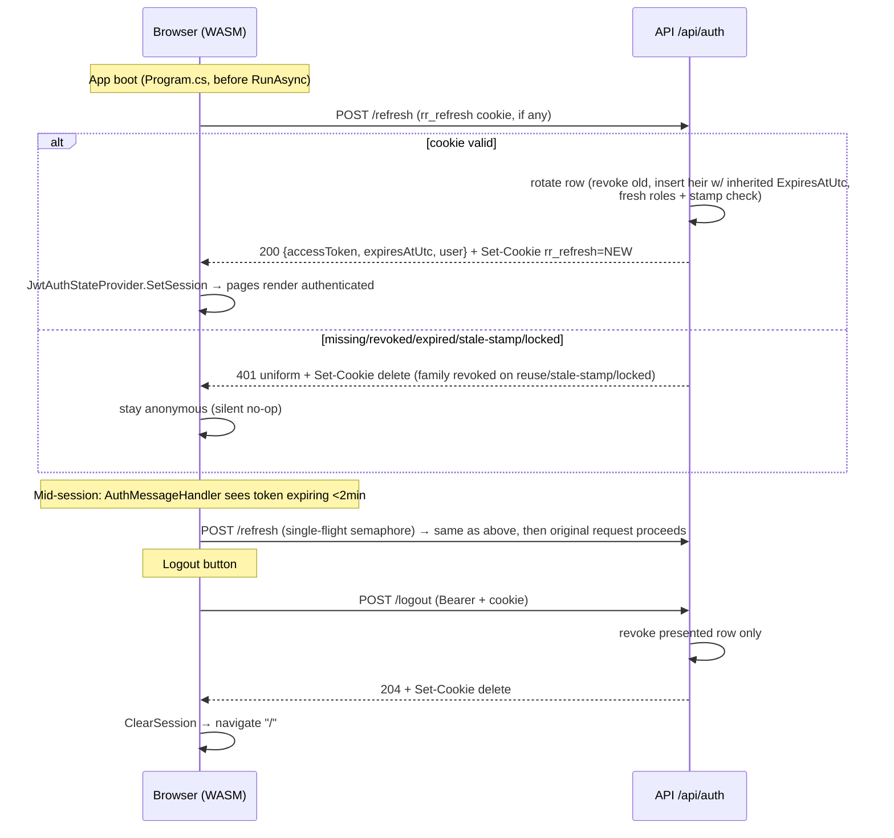

All context absorbed and verified against source: research report (R1–R9, risks 1–10, Q1–Q6), PROJECT-CONTEXT §4/§5/§7 (D-004…D-011), F0-blueprint B2/B4/B5/B6, [docs/api-conventions.md](docs/api-conventions.md), [AuthSetup.cs](src/RapidRelief.Api/Infrastructure/Auth/AuthSetup.cs), [FakeAuthHandler.cs](src/RapidRelief.Api/Infrastructure/Auth/FakeAuthHandler.cs), [AuthPolicies.cs](src/RapidRelief.Api/Infrastructure/Auth/AuthPolicies.cs), [SampleModule.cs](src/RapidRelief.Api/Features/Sample/SampleModule.cs), [SampleDbContext.cs](src/RapidRelief.Api/Features/Sample/Data/SampleDbContext.cs), [PingEndpoints.cs](src/RapidRelief.Api/Features/Sample/Endpoints/PingEndpoints.cs), [FakeUserAdminService.cs](src/RapidRelief.Api/Features/Stubs/FakeUserAdminService.cs), [TestingWebAppFactory.cs](tests/RapidRelief.Api.Tests/TestingWebAppFactory.cs), [ProductionAuthTests.cs](tests/RapidRelief.Api.Tests/Auth/ProductionAuthTests.cs), [LocalDiskFileStorage.cs](src/RapidRelief.Api/Infrastructure/Storage/LocalDiskFileStorage.cs), [Program.cs](src/RapidRelief.Api/Program.cs) (API), [Program.cs](src/RapidRelief.Client/Program.cs) (Client), [DevRoleHandler.cs](src/RapidRelief.Client/Common/Auth/DevRoleHandler.cs), [DevRolePicker.razor](src/RapidRelief.Client/Common/Auth/DevRolePicker.razor), [DevRoleState.cs](src/RapidRelief.Client/Common/Auth/DevRoleState.cs), [App.razor](src/RapidRelief.Client/App.razor), [MainLayout.razor](src/RapidRelief.Client/Layout/MainLayout.razor), [ci.yml](.github/workflows/ci.yml), [appsettings.json](src/RapidRelief.Api/appsettings.json), arch tests, plan F1/F13 cards.

---

# F1 — Authentication, Profiles & RBAC: Implementation Blueprint

## DECISIONS

Ready to paste into PROJECT-CONTEXT.md §7 (chunk B commits them; dates = merge date):

| ID | Date | Decision | Why |
|---|---|---|---|
| D-012 | 2026-09-01 | **Refresh cookie contract:** name `rr_refresh`, `HttpOnly`, `SameSite=Strict`, **`Path=/api/auth`** (Q1), `Secure` gated on **`!IsDevelopment() && !IsEnvironment("Testing")`**, `Expires` = the refresh row's `ExpiresAtUtc` (≤7d). CSRF posture = Strict cookie + JSON-body/Bearer endpoints; no antiforgery infrastructure. | `Path=/api/auth` lets `/logout` see the cookie (no raw token in body); Testing joins the Secure gate because `CookieContainer` silently drops `Secure` cookies over the factory's `http://localhost` (same condition as the existing D-010 HSTS gate); Dev stays plain-HTTP per D-010. |
| D-013 | 2026-09-01 | **Token lifetimes:** access JWT **30 min** (`Jwt:AccessTokenMinutes`), refresh **7 days absolute** (`Jwt:RefreshTokenDays`) — rotation **inherits** `ExpiresAtUtc` from the replaced row (no sliding); JwtBearer **`ClockSkew = 1 min`** (Q3). | R2/R9 recommendation; issuer and validator share one clock, so 5-min default skew only stretches the TTL; inheritance makes "absolute" true in one line. |
| D-014 | 2026-09-01 | **Server-side invalidation:** lock and role-change do **both** `UpdateSecurityStampAsync` **and** immediate revocation of all active refresh rows (Q2); refresh validates `SecurityStampAtIssue` against the live stamp; **reuse of a revoked token revokes the whole family** and publishes `AuthEvent("TokenReuse")`. | Lock/role change becomes effective at next refresh (worst case = 30-min access TTL); stamp check catches any revocation path missed; family revocation is the standard stolen-token response (R2/R6). |
| D-015 | 2026-09-01 | **Profile photo read path:** authenticated `GET /api/auth/profile/photo` streaming the caller's own photo via `IFileStorage.OpenReadAsync` (Q4). The blueprint-B4 "public upload serving" decision stays deferred to F2. | Zero new static-file surface; reuses hardened `LocalDiskFileStorage` traversal-safe read; photos are private-by-default. |
| D-016 | 2026-09-01 | **Registration policy:** `/register` is Citizen self-serve only — server hard-assigns `Citizen`, request carries no role field; NGO/Rescue/Admin accounts are provisioned by Admin promote via `PUT /api/auth/users/{id}/roles` (register-then-promote). F13's "NGO/volunteer self-registration" = a **future additive surface** (role request/approval consuming `IUserAdminService`), owned by F13, not built in F1 (Q5). | Kills the one-line privilege-escalation risk (research risk 9); standard practice for privileged roles; keeps F13's option open without contract changes. |
| D-017 | 2026-09-01 | **Fixed role GUIDs** (Q6), seeded in all environments: Citizen `aaaaaaaa-0000-0000-0000-000000000001`, Rescue `…0002`, Admin `…0003`, NGO `…0004` (constant map `AuthSeeder.RoleIds`, ordinal-matching `FakeAuthHandler.SeedUserIds`). | Deterministic role IDs across dev/CI/prod DBs simplify debugging, fixtures, and any future cross-env data move; costs nothing. |
| D-018 | 2026-09-01 | **PasswordHasher `IterationCount` = 210,000** (OWASP for PBKDF2-HMAC-SHA512), config knob `Auth:PasswordHasherIterations`; `TestingWebAppFactory` overrides to 10,000 for suite speed. | .NET 8 default is 100k (verified from source, R5); the V3 hash format embeds the per-hash count, so mixed counts verify correctly and old hashes auto-flag `SuccessRehashNeeded` — the override is safe. |
| D-019 | 2026-09-01 | **Auth wire DTOs are feature-local, NOT contracts:** server records in `RapidRelief.Api.Features.Auth.Endpoints`, hand-mirrored client records in `RapidRelief.Client.Features.Auth`. `Shared/Contracts` is untouched by F1 (existing `UserSummaryDto`/`AuthEvent`/`IUserAdminService` consumed as-is). | These DTOs are F1's own client↔server wire shapes, not cross-module surfaces (§6 registry definition); duplication is the price of the contract freeze (§4.6) and matches the "slice-local DTOs live beside their endpoints" convention. |

---

## BLUEPRINT

### 1. Packages (only delta; versions pinned like existing)

| Project | Add | Version |
|---|---|---|
| RapidRelief.Api | `Microsoft.AspNetCore.Identity.EntityFrameworkCore` | 8.0.30 |
| RapidRelief.Client | `Microsoft.AspNetCore.Components.Authorization` | 8.0.30 |

No client JWT library (manual payload parse), no new server JWT package (`JwtSecurityTokenHandler` flows via JwtBearer).

### 2. File tree

```
src/RapidRelief.Api/Features/Auth/
  AuthModule.cs                          # IFeatureModule, Name="Auth", Order=0 (default)
  Domain/AppUser.cs                      # : IdentityUser<Guid>
  Domain/RefreshToken.cs
  Data/AuthDbContext.cs                  # namespace RapidRelief.Api.Features.Auth.Data (arch-test rule)
  Data/Migrations/…                      # generated — see §11 command
  Endpoints/AuthDtos.cs                  # all request/response records + FluentValidation validators (D-019)
  Endpoints/AuthEndpoints.cs             # register/login/refresh/logout/profile/photo (8 endpoints)
  Endpoints/UserAdminEndpoints.cs        # users list / lock / roles (3 endpoints)
  Services/ITokenService.cs
  Services/TokenService.cs
  Services/IdentityUserAdminService.cs   # real IUserAdminService
  Seeding/AuthSeeder.cs                  # static SeedAsync + RoleIds map

src/RapidRelief.Client/
  Common/Auth/JwtAuthStateProvider.cs    # NEW
  Common/Auth/AuthMessageHandler.cs      # NEW
  Common/Auth/RedirectToLogin.razor      # NEW
  Common/Auth/LoginDisplay.razor         # NEW (top-row sign-in/out)
  Common/Auth/DevRolePicker.razor        # MODIFIED (disabled when signed in)
  Features/Auth/AuthClient.cs            # NEW — all auth HTTP calls
  Features/Auth/AuthModels.cs            # NEW — client mirrors of wire DTOs (D-019)
  Features/Auth/Pages/Login.razor        # @page "/login"
  Features/Auth/Pages/Register.razor     # @page "/register"
  Features/Auth/Pages/Profile.razor      # @page "/profile", [Authorize]
  App.razor                              # MODIFIED — AuthorizeRouteView
  Program.cs                             # MODIFIED — DI + handler chain + boot refresh
  Layout/MainLayout.razor                # MODIFIED — <LoginDisplay />
  _Imports.razor                         # MODIFIED — @using Microsoft.AspNetCore.Components.Authorization

src/RapidRelief.Api/Infrastructure/Auth/AuthSetup.cs   # MODIFIED — one line: ClockSkew (D-013)
src/RapidRelief.Api/appsettings.json                   # MODIFIED — Jwt TTLs + Auth section
src/RapidRelief.Api/appsettings.Development.json       # MODIFIED — dev-only Jwt:SigningKey (≥32 bytes)
tests/RapidRelief.Api.Tests/TestingWebAppFactory.cs    # MODIFIED — AuthDbContext + key + seeder
tests/RapidRelief.Api.Tests/Auth/                      # NEW test files (see TEST PLAN)
.github/workflows/ci.yml                               # MODIFIED — AuthDbContext fidelity line
docs/architecture/F1-blueprint.md                      # this document (committed in chunk B)
PROJECT-CONTEXT.md                                     # updated in BOTH chunks (mandatory)
```

`Features/Auth` references only itself, `Infrastructure/*`, and `Shared/Contracts` — same as Sample. (Features→Infrastructure is allowed; [ModuleIsolationTests.cs](tests/RapidRelief.Architecture.Tests/ModuleIsolationTests.cs) only forbids feature→feature and Infrastructure→feature.)

### 3. Entities

```csharp
// Domain/AppUser.cs — namespace RapidRelief.Api.Features.Auth.Domain
public sealed class AppUser : IdentityUser<Guid>
{
    public string DisplayName { get; set; } = string.Empty;   // required, max 100
    public string? EmergencyContact { get; set; }             // max 100
    public string? PhotoPath { get; set; }                    // max 260 — IFileStorage relative path
    // PhoneNumber inherited from IdentityUser
}

// Domain/RefreshToken.cs
public sealed class RefreshToken
{
    public Guid Id { get; set; }                       // PK, client-generated Guid.NewGuid()
    public Guid UserId { get; set; }                   // FK → auth_users (same module: FK allowed), no navigation property
    public string TokenHash { get; set; } = "";        // required, max 64 — Base64(SHA-256(raw)), 44 chars
    public string SecurityStampAtIssue { get; set; } = ""; // required, max 64
    public DateTimeOffset CreatedAtUtc { get; set; }
    public DateTimeOffset ExpiresAtUtc { get; set; }   // absolute — inherited on rotation (D-013)
    public DateTimeOffset? RevokedAtUtc { get; set; }  // null = active
    public string? ReplacedByTokenHash { get; set; }   // max 64
}
```

Constraints/indexes (in `OnModelCreating`): unique index on `TokenHash`; non-unique index on `UserId`; FK `UserId → auth_users.Id` (`HasOne<AppUser>().WithMany().HasForeignKey(t => t.UserId)`, cascade delete). **SQLite ticks gate** (copy [SampleDbContext.cs](src/RapidRelief.Api/Features/Sample/Data/SampleDbContext.cs#L31-L40) pattern) on `CreatedAtUtc`, `ExpiresAtUtc`, `RevokedAtUtc` — all three appear in SQL `WHERE`; the nullable one uses the same converter (EF wraps nulls automatically). Identity's own `LockoutEnd` is **not** gated — and must therefore never be compared inside a SQL query (see §8).

### 4. AuthDbContext skeleton

```csharp
// Data/AuthDbContext.cs — namespace RapidRelief.Api.Features.Auth.Data
public sealed class AuthDbContext : IdentityDbContext<AppUser, IdentityRole<Guid>, Guid>
{
    public const string MigrationsHistoryTableName = "__efmigrationshistory_auth";

    public AuthDbContext(DbContextOptions<AuthDbContext> options) : base(options) { }

    public DbSet<RefreshToken> RefreshTokens => Set<RefreshToken>();

    protected override void OnModelCreating(ModelBuilder b)
    {
        base.OnModelCreating(b);                                  // MUST be first (research risk 2)
        b.Entity<AppUser>(u => {
            u.ToTable("auth_users");
            u.Property(x => x.DisplayName).IsRequired().HasMaxLength(100);
            u.Property(x => x.EmergencyContact).HasMaxLength(100);
            u.Property(x => x.PhotoPath).HasMaxLength(260);
        });
        b.Entity<IdentityRole<Guid>>().ToTable("auth_roles");
        b.Entity<IdentityUserRole<Guid>>().ToTable("auth_user_roles");
        b.Entity<IdentityUserClaim<Guid>>().ToTable("auth_user_claims");
        b.Entity<IdentityUserLogin<Guid>>().ToTable("auth_user_logins");
        b.Entity<IdentityUserToken<Guid>>().ToTable("auth_user_tokens");
        b.Entity<IdentityRoleClaim<Guid>>().ToTable("auth_role_claims");
        b.Entity<RefreshToken>(t => {
            t.ToTable("auth_refresh_tokens");
            t.HasKey(x => x.Id);
            t.Property(x => x.TokenHash).IsRequired().HasMaxLength(64);
            t.Property(x => x.SecurityStampAtIssue).IsRequired().HasMaxLength(64);
            t.Property(x => x.ReplacedByTokenHash).HasMaxLength(64);
            t.HasIndex(x => x.TokenHash).IsUnique();
            t.HasIndex(x => x.UserId);
            t.HasOne<AppUser>().WithMany().HasForeignKey(x => x.UserId).OnDelete(DeleteBehavior.Cascade);
            if (Database.ProviderName == "Microsoft.EntityFrameworkCore.Sqlite")
            {
                // ticks conversions for CreatedAtUtc / ExpiresAtUtc / RevokedAtUtc (Sample pattern)
            }
        });
    }
}
```

### 5. Token service spec

```csharp
// Services/ITokenService.cs — namespace RapidRelief.Api.Features.Auth.Services
public interface ITokenService
{
    (string AccessToken, DateTimeOffset ExpiresAtUtc) CreateAccessToken(AppUser user, IReadOnlyList<string> roles);
    Task<string> IssueRefreshTokenAsync(AppUser user, DateTimeOffset? inheritedAbsoluteExpiry, CancellationToken ct); // returns RAW token
    Task<RefreshOutcome> ValidateAndRotateAsync(string rawToken, CancellationToken ct);
    Task RevokeAsync(string rawToken, CancellationToken ct);            // logout: revoke that row only, idempotent
    Task RevokeAllForUserAsync(Guid userId, CancellationToken ct);      // admin lock / role change (D-014)
}
public sealed record RefreshOutcome(bool Succeeded, string? AccessToken, DateTimeOffset? AccessExpiresAtUtc,
    string? NewRawRefreshToken, DateTimeOffset? RefreshExpiresAtUtc, AppUser? User, IReadOnlyList<string>? Roles,
    string? FailureReason);   // FailureReason feeds logs/AuthEvent only — the HTTP response is always uniform 401
```

Implementation rules (`TokenService`, deps: `AuthDbContext`, `UserManager<AppUser>`, `IConfiguration`, `TimeProvider`, `IEventBus`):

- **Access JWT (R9):** `JwtSecurityTokenHandler` with default claim maps (**never** `MapInboundClaims = false`). Claims minted with `ClaimTypes.NameIdentifier` = `user.Id`, `ClaimTypes.Name` = `user.Email`, one `ClaimTypes.Role` per role, plus `JwtRegisteredClaimNames.Jti` = new Guid. Signing: `SymmetricSecurityKey(UTF8(Jwt:SigningKey))`, HmacSha256; `iss`/`aud` from `Jwt:Issuer|Audience`; `exp` = now + `Jwt:AccessTokenMinutes` (default 30). Round-trip through JwtBearer's inbound map restores `ClaimTypes.*` — principal identical to [FakeAuthHandler.cs](src/RapidRelief.Api/Infrastructure/Auth/FakeAuthHandler.cs#L47-L52)'s, so [AuthPolicies.cs](src/RapidRelief.Api/Infrastructure/Auth/AuthPolicies.cs) works unchanged. No security-stamp claim (D-014 uses the row check).
- **Raw refresh token:** `RandomNumberGenerator.GetBytes(32)` → `WebEncoders.Base64UrlEncode`. **At rest:** `Convert.ToBase64String(SHA256.HashData(Encoding.UTF8.GetBytes(raw)))` → `TokenHash`. Lookup is by exact hash via the unique index (no constant-time comparison needed).
- **Issue:** row = `{ Id=NewGuid, UserId, TokenHash, SecurityStampAtIssue = user.SecurityStamp!, CreatedAtUtc = now, ExpiresAtUtc = inheritedAbsoluteExpiry ?? now + Jwt:RefreshTokenDays(7d) }`. Login/register pass `null` (new family); rotation passes the old row's `ExpiresAtUtc` (D-013).
- **`ValidateAndRotateAsync(raw)`** — single `SaveChangesAsync` at the end:
  1. Hash → load row by `TokenHash`. Missing → fail `"Unknown"`.
  2. `RevokedAtUtc != null` → **reuse**: set `RevokedAtUtc = now` on all active rows of `row.UserId`, publish `AuthEvent(row.UserId, "TokenReuse", null)`, fail `"Reuse"`.
  3. `ExpiresAtUtc <= now` → fail `"Expired"`.
  4. Load user via `UserManager.FindByIdAsync`. Missing → fail `"NoUser"`. `IsLockedOutAsync` → revoke-all + fail `"LockedOut"`.
  5. `user.SecurityStamp != row.SecurityStampAtIssue` → revoke-all + fail `"StaleStamp"`.
  6. Success: `row.RevokedAtUtc = now`, `row.ReplacedByTokenHash = newHash`; insert replacement row with **inherited** `ExpiresAtUtc` and **current** `user.SecurityStamp`; mint access token with **fresh** `GetRolesAsync` roles.
- **Revoke-all:** load active rows (`UserId == id && RevokedAtUtc == null`), set `RevokedAtUtc = now`, save. Load-then-update, **not** `ExecuteUpdateAsync` — provider-portable with the ticks converter, and rows-per-user is tiny.
- All timestamps from `TimeProvider.GetUtcNow()` (D-009 precedent; `AuthModule` does `TryAddSingleton(TimeProvider.System)`).

### 6. Endpoint specs — 11 endpoints, all `/api/auth` group

Conventions apply everywhere: explicit FluentValidation in-endpoint, `ApiEnvelope<T>` success, ProblemDetails errors, **`DatabaseHealth` gate first** → 503 `DatabaseUnavailable()` exactly like [PingEndpoints.cs](src/RapidRelief.Api/Features/Sample/Endpoints/PingEndpoints.cs#L120-L126) (all 11 are DB-backed; FakeAuth keeps the demo alive in degraded mode).

| # | Endpoint | Auth | Rate limit | Request → Response |
|---|---|---|---|---|
| 1 | `POST /register` | `AllowAnonymous` | `RequireRateLimiting("auth")` | `RegisterRequest` → 201 + `ApiEnvelope<AuthSessionDto>` + cookie (auto-login), `Location: /api/auth/profile` |
| 2 | `POST /login` | `AllowAnonymous` | `RequireRateLimiting("auth")` | `LoginRequest` → 200 + `ApiEnvelope<AuthSessionDto>` + cookie |
| 3 | `POST /refresh` | `AllowAnonymous` | `RequireRateLimiting("auth")` | cookie only → 200 + `ApiEnvelope<AuthSessionDto>` + rotated cookie |
| 4 | `POST /logout` | `RequireAuthorization()` | global | cookie → 204 + cookie delete (idempotent: missing/revoked row still 204) |
| 5 | `GET /profile` | `RequireAuthorization()` | global | → 200 `ApiEnvelope<UserProfileDto>` (caller's own, id from `ClaimTypes.NameIdentifier`) |
| 6 | `PUT /profile` | `RequireAuthorization()` | global | `UpdateProfileRequest` → 200 `ApiEnvelope<UserProfileDto>` (email immutable in F1) |
| 7 | `POST /profile/photo` | `RequireAuthorization()` | global | multipart `IFormFile file` → 200 `ApiEnvelope<UserProfileDto>`; **`.DisableAntiforgery()`** (Bearer auth ⇒ CSRF n/a; without it .NET 8 form-binding throws at startup); `ArgumentException` from `IFileStorage.SaveAsync` → 400 ValidationProblem (`file` key); replaces: save new → set `PhotoPath` → best-effort `DeleteAsync(old)` |
| 8 | `GET /profile/photo` | `RequireAuthorization()` | global | → 200 stream (`IFileStorage.OpenReadAsync(user.PhotoPath)`, content type via `FileExtensionContentTypeProvider`, fallback `application/octet-stream`); no photo/missing file → 404 ProblemDetails (D-015) |
| 9 | `GET /users?page=&pageSize=` | `AuthPolicies.RequireAdmin` | global | → 200 `ApiEnvelope<PagedResult<UserSummaryDto>>` (service clamps too) |
| 10 | `POST /users/{id:guid}/lock` | `AuthPolicies.RequireAdmin` | global | `SetLockRequest(bool Locked)` → 204; unknown id → 404 ProblemDetails; `id == caller` → 400 ("Cannot lock your own account") |
| 11 | `PUT /users/{id:guid}/roles` | `AuthPolicies.RequireAdmin` | global | `SetRolesRequest(IReadOnlyList<string> Roles)` → 204; unknown id → 404; `id == caller` → 400 ("Cannot change your own roles") |

**DTOs + validation** (all in `Endpoints/AuthDtos.cs`, namespace `RapidRelief.Api.Features.Auth.Endpoints` — D-019):

```csharp
public sealed record RegisterRequest(string? Email, string? Password, string? DisplayName,
    string? PhoneNumber, string? EmergencyContact);          // NO role field — ever (D-016)
public sealed record LoginRequest(string? Email, string? Password);
public sealed record UpdateProfileRequest(string? DisplayName, string? PhoneNumber, string? EmergencyContact);
public sealed record SetLockRequest(bool Locked);
public sealed record SetRolesRequest(IReadOnlyList<string>? Roles);
public sealed record UserProfileDto(Guid Id, string Email, string DisplayName, string? PhoneNumber,
    string? EmergencyContact, bool HasPhoto, IReadOnlyList<string> Roles);
public sealed record AuthSessionDto(string AccessToken, DateTimeOffset ExpiresAtUtc, UserProfileDto User);
```

Validators: `RegisterRequestValidator` — Email NotEmpty, EmailAddress, ≤256; Password NotEmpty, ≤128 (complexity is Identity's job); DisplayName NotEmpty ≤100; PhoneNumber ≤20; EmergencyContact ≤100. `LoginRequestValidator` — Email NotEmpty ≤256, Password NotEmpty ≤128 (**validate before any DB touch** — the rate-limit pin test depends on this fast path). `UpdateProfileRequestValidator` — DisplayName NotEmpty ≤100, others as register. `SetRolesRequestValidator` — Roles NotEmpty, every entry ∈ `Roles.All` (ordinal, case-sensitive — research risk 10).

**Error semantics:**
- **Register:** `UserManager.CreateAsync` failure → `Results.ValidationProblem` with dictionary keyed by `IdentityResult.Errors[].Code` → `[Description]` (e.g. `"DuplicateUserName": […]`) — the `MapIdentityApi` shape. Duplicate-email disclosure here is accepted (industry parity; mitigated by the `auth` rate limit).
- **Login/refresh: uniform 401** — identical ProblemDetails (`title: "Invalid credentials."`, no detail) for unknown email, wrong password, locked account, and every refresh failure reason. Reasons go to `AuthEvent`/logs only. Login flow: validate shape → 503-gate → `FindByEmailAsync` (null → 401) → `SignInManager.CheckPasswordSignInAsync(user, pwd, lockoutOnFailure: true)` (defaults: 5 attempts/5-min lockout) → not succeeded → 401.
- **Refresh failure additionally deletes the cookie** (prevents client refresh loops).
- **Cookie set/clear helper (D-012):** `Append("rr_refresh", raw, new CookieOptions { HttpOnly = true, SameSite = SameSiteMode.Strict, Path = "/api/auth", Secure = <!Dev && !Testing>, Expires = refreshRowExpiresAtUtc })`; delete with **identical Path/attributes** or browsers won't match.

**AuthEvents published** (via `IEventBus`; zero handlers today = silent success): `Register`, `Login`, `LoginFailed` (details = reason, `Guid.Empty` for unknown email; never the password), `Logout`, `TokenReuse`, `Lock`, `Unlock`, `RoleChange` (details = new role csv).

### 7. Refresh flow sequence



Accepted limitation (record in risks): two tabs refreshing the same cookie concurrently can trip reuse detection → whole family revoked → both tabs re-login. Boot-refresh + single-flight makes this rare; worst case is one extra login.

### 8. `IdentityUserAdminService` (real `IUserAdminService`)

Registered `services.AddScoped<IUserAdminService, IdentityUserAdminService>()` in `AuthModule` — plain `AddScoped` displaces [FakeUserAdminService.cs](src/RapidRelief.Api/Features/Stubs/FakeUserAdminService.cs) automatically via StubsModule's `TryAdd` stub-yield (B5). Contract is frozen — the service adapts to it exactly.

- **`GetUsersAsync(page, pageSize)`**: clamp page 1–1,000,000 / pageSize 1–200 **before math**; query `Users.OrderBy(u => u.Email).ThenBy(u => u.Id)`, `Skip/Take`, materialize the page; then **one** roles query for the page's user ids (join `UserRoles`×`Roles`, group in memory — no N+1); **`IsLocked` computed in memory** after materialization (`LockoutEnd.HasValue && LockoutEnd > now`) — `LockoutEnd` is not ticks-gated, comparing it in SQL breaks SQLite. `TotalCount` = full `Users.CountAsync()`.
- **`SetLockedAsync(id, locked)`**: `FindByIdAsync` → null ⇒ `false`. Lock: `SetLockoutEnabledAsync(user, true)` + `SetLockoutEndDateAsync(user, DateTimeOffset.MaxValue)`; unlock: `SetLockoutEndDateAsync(user, null)` + `ResetAccessFailedCountAsync`. Both paths: `UpdateSecurityStampAsync(user)`. **Lock only:** `ITokenService.RevokeAllForUserAsync` (D-014). Publish `AuthEvent(id, locked ? "Lock" : "Unlock", null)`. Return `true`.
- **`SetRolesAsync(id, roles)`**: unknown user ⇒ `false` (fake-parity semantics). Roles validated against `Roles.All` (ordinal) — invalid ⇒ `ArgumentException` (endpoint's validator prevents reaching it; the service check is the security backstop per research risk 7). Apply diff: `RemoveFromRolesAsync(current.Except(target))` + `AddToRolesAsync(target.Except(current))` → `UpdateSecurityStampAsync` → `RevokeAllForUserAsync` → `AuthEvent(id, "RoleChange", csv)` → `true`.

### 9. AuthSeeder

`Seeding/AuthSeeder.cs` — `public static class AuthSeeder`, `public static async Task SeedAsync(IServiceProvider scopedServices, CancellationToken ct)`. Resolves `RoleManager<IdentityRole<Guid>>`, `UserManager<AppUser>`, `IHostEnvironment`.

- **Roles — all environments**, fixed GUIDs (D-017): per role in `Roles.All`: `RoleExistsAsync(role)` → false ⇒ `CreateAsync(new IdentityRole<Guid>(role) { Id = RoleIds[role] })`. `public static readonly IReadOnlyDictionary<string, Guid> RoleIds` with the D-017 values. Role names exactly the `Roles` constants (`"NGO"`, not `"Ngo"` — risk 10).
- **Demo users — Development OR Testing only** (Testing needs them for login tests; the research's "Dev only" intent is "never Production/Staging"): per role: `FindByEmailAsync($"{role.ToLowerInvariant()}1@rr.dev")` → null ⇒ `new AppUser { Id = FakeAuthHandler.SeedUserIds[role], UserName = email, Email = email, EmailConfirmed = true, DisplayName = $"{role} One" }` → `CreateAsync(user, "Demo!123")` → `AddToRoleAsync(user, role)`. Explicit non-empty `Id` suppresses EF's Guid autogeneration; GUIDs + `DisplayName` match [FakeAuthHandler.cs](src/RapidRelief.Api/Infrastructure/Auth/FakeAuthHandler.cs#L19-L26) and the fake admin service.
- **Idempotent** by the two exists-checks; safe to run every boot.
- **Invoked from both**: `AuthModule.MigrateAsync` (after `Database.MigrateAsync`) and `TestingWebAppFactory.CreateHost` (after `EnsureCreated<AuthDbContext>` — MigrationRunner never runs in Testing, research R5 catch). Seeder failure inside `MigrateAsync` is swallowed by MigrationRunner's retry/warn (D-005) — Production factories with no DB stay boot-safe.
- Iteration count is *not* the seeder's concern — it flows from DI `PasswordHasherOptions` (D-018), so seeded and registered users hash identically per environment.

### 10. AuthModule

```csharp
public sealed class AuthModule : IFeatureModule   // Name = "Auth", default Order 0
{
    public void AddModule(IServiceCollection services, IConfiguration config, IHostEnvironment env)
    {
        if (!env.IsEnvironment("Testing"))                    // factory injects SQLite itself (B6 step 8)
            services.AddDbContext<AuthDbContext>(o => o.UseNpgsql(config.GetConnectionString("Postgres"),
                n => n.MigrationsHistoryTable(AuthDbContext.MigrationsHistoryTableName)));

        services.AddIdentityCore<AppUser>(o =>                // NEVER AddIdentity (research risk 1)
            {
                o.User.RequireUniqueEmail = true;
                // password + lockout stay at Identity defaults (≥6, upper/lower/digit/symbol; 5 tries/5 min)
            })
            .AddRoles<IdentityRole<Guid>>()
            .AddEntityFrameworkStores<AuthDbContext>()
            .AddSignInManager();                               // no AddDefaultTokenProviders (R1)

        services.AddHttpContextAccessor();                     // SignInManager dependency
        services.Configure<PasswordHasherOptions>(o =>
            o.IterationCount = config.GetValue("Auth:PasswordHasherIterations", 210_000));   // D-018
        services.TryAddSingleton(TimeProvider.System);         // D-009 precedent
        services.AddScoped<ITokenService, TokenService>();
        services.AddScoped<IUserAdminService, IdentityUserAdminService>();   // displaces the fake (B5)
    }
    public void MapEndpoints(IEndpointRouteBuilder e) { AuthEndpoints.Map(e); UserAdminEndpoints.Map(e); }
    public async Task MigrateAsync(IServiceProvider sp, CancellationToken ct)
    {
        await sp.GetRequiredService<AuthDbContext>().Database.MigrateAsync(ct);
        await AuthSeeder.SeedAsync(sp, ct);
    }
}
```

### 11. Config, infrastructure edit, migration command, CI

- [AuthSetup.cs](src/RapidRelief.Api/Infrastructure/Auth/AuthSetup.cs) — **single line added** to `TokenValidationParameters`: `ClockSkew = TimeSpan.FromMinutes(1)` (D-013). No other Program.cs/API changes — rate limiting is applied per-endpoint in the module (the `"auth"` policy already exists in [Program.cs](src/RapidRelief.Api/Program.cs#L76-L84); F1 wires the call sites, mandatory per D-011).
- [appsettings.json](src/RapidRelief.Api/appsettings.json): `Jwt` gains `"AccessTokenMinutes": 30, "RefreshTokenDays": 7`; new section `"Auth": { "PasswordHasherIterations": 210000 }`.
- appsettings.Development.json: add `"Jwt": { "SigningKey": "<committed dev-only key, ≥32 bytes, clearly labeled not-a-secret>" }` — without it, Development login mints with an empty key and throws. The fail-fast guard (non-Dev/Testing) is untouched.
- **Migration:** `dotnet ef migrations add Initial --project src/RapidRelief.Api --context AuthDbContext --output-dir Features/Auth/Data/Migrations`.
- **CI:** add to the `postgres-fidelity` job (after the Sample line): `dotnet ef database update --project src/RapidRelief.Api --context AuthDbContext` with the same env — proves the migration is valid Npgsql SQL.
- **TestingWebAppFactory:** `AddSqliteContext<AuthDbContext>(services)`; `builder.UseSetting("Jwt:SigningKey", new string('t', 64))` (Testing mints/validates real JWTs); `builder.UseSetting("Auth:PasswordHasherIterations", "10000")`; in `CreateHost`: `EnsureCreated<AuthDbContext>(host)` then seed via a scope (`AuthSeeder.SeedAsync(scope.ServiceProvider, default).GetAwaiter().GetResult()`).

### 12. Client specification

**`JwtAuthStateProvider`** (singleton; also registered as `AuthenticationStateProvider`): holds `ClaimsPrincipal _user` (anonymous default), `string? AccessToken`, `DateTimeOffset ExpiresAtUtc`. `SetSession(token, expiresAtUtc)` parses and notifies; `ClearSession()` resets and notifies. **Parse:** split `'.'`, take `[1]`, Base64Url-decode (restore padding), `JsonDocument`: userId = `"nameid"` ?? `"sub"` → `ClaimTypes.NameIdentifier`; `"unique_name"` → `ClaimTypes.Name`; `"role"` (string **or** array) → `ClaimTypes.Role` each (covers both outbound-map spellings). Identity created with `authenticationType: "jwt"` (non-null ⇒ `IsAuthenticated`).

**`AuthMessageHandler`** (chained **after** `DevRoleHandler`, i.e. inner): same-origin guard identical to [DevRoleHandler.cs](src/RapidRelief.Client/Common/Auth/DevRoleHandler.cs#L31-L41) (Bearer must never leak to tile servers). When `AccessToken` present and target same-origin: (1) if `ExpiresAtUtc - now < 2 min` and the request is not itself `/api/auth/refresh` → single-flight (static `SemaphoreSlim(1,1)`) proactive refresh: build a fresh `POST /api/auth/refresh` `HttpRequestMessage`, send via `base.SendAsync`, on 200 parse `data.accessToken`/`expiresAtUtc` with `JsonDocument` → `SetSession`; on failure → `ClearSession`. No retry/cloning of the original request — it is sent exactly once, after. (2) Set `Authorization: Bearer <token>` and **`request.Headers.Remove("X-Dev-Role")`** — real login wins (R4).

**`AuthClient`** (scoped; uses the app `HttpClient`): `RegisterAsync`, `LoginAsync` (→ `SetSession`, return validation errors for display), `TryBootRefreshAsync` (POST refresh; swallow **all** failures incl. network — offline PWA boot must not crash; 5-s `CancellationTokenSource` cap), `LogoutAsync` (POST logout, ignore failures, always `ClearSession`), `GetProfileAsync`, `UpdateProfileAsync`, `UploadPhotoAsync` (`MultipartFormDataContent`, field name `file`), `GetProfilePhotoDataUrlAsync` — fetches bytes via HttpClient and returns a base64 data URL, because **an `` tag cannot send a Bearer header** (D-015 read path is authenticated).

**Client Program.cs** ([Program.cs](src/RapidRelief.Client/Program.cs)):

```csharp
builder.Services.AddSingleton<DevRoleState>();
builder.Services.AddSingleton<JwtAuthStateProvider>();
builder.Services.AddSingleton<AuthenticationStateProvider>(sp => sp.GetRequiredService<JwtAuthStateProvider>());
builder.Services.AddAuthorizationCore();
builder.Services.AddCascadingAuthenticationState();          // .NET 8 replacement for the wrapper component
builder.Services.AddScoped<AuthClient>();
// chain: DevRoleHandler (outer) → AuthMessageHandler (inner, strips X-Dev-Role when token present) → HttpClientHandler
builder.Services.AddScoped(sp => new HttpClient(
    new DevRoleHandler(sp.GetRequiredService<DevRoleState>(), baseAddress)
    { InnerHandler = new AuthMessageHandler(sp.GetRequiredService<JwtAuthStateProvider>(), baseAddress)
      { InnerHandler = new HttpClientHandler() } })
    { BaseAddress = baseAddress });

var host = builder.Build();
await host.Services.GetRequiredService<AuthClient>().TryBootRefreshAsync();   // F5 session restore (R3)
await host.RunAsync();
```

Same-origin cookie note: WASM `HttpClient` defaults to `same-origin` credentials — the hosted app needs no `SetBrowserRequestCredentials` call.

**App.razor:** swap `RouteView` → `AuthorizeRouteView`; `<NotAuthorized>`: if `!context.User.Identity!.IsAuthenticated` → `<RedirectToLogin />` (navigates `/login?returnUrl={Uri.EscapeDataString(current)}`), else "Not authorized" text. Existing pages stay attribute-free — **client route protection keys off real JWT sessions only; X-Dev-Role never unlocks client pages** (it remains an API-level dev tool, so teammates are unaffected — F1 DoD).

**Pages** (all use `EditForm` + `DataAnnotationsValidator`-free manual binding or FluentValidation-style manual checks — display server `ValidationProblem` errors per-field from the 400 payload; keep it simple, server is the authority):
- **Login.razor** (`/login`): email+password form; on success → navigate `returnUrl ?? "/"`; on 401 → single generic "Invalid credentials." banner; link to register. If already authenticated → immediate redirect home.
- **Register.razor** (`/register`): email/password/display name/phone/emergency contact; field-level errors from the 400 dictionary (incl. Identity codes); success = auto-login → home.
- **Profile.razor** (`/profile`, `@attribute [Authorize]`): loads `GET /profile`; edit form for DisplayName/Phone/EmergencyContact (email shown read-only); photo section: current photo via data URL, `InputFile` (client pre-check: extension ∈ jpg/jpeg/png/webp, ≤10 MiB — server still authoritative), upload button; logout button.
- **LoginDisplay.razor** in [MainLayout.razor](src/RapidRelief.Client/Layout/MainLayout.razor) top row: `AuthorizeView` — Authorized: display name + Profile link + Sign out (calls `AuthClient.LogoutAsync` → navigate `/`); NotAuthorized: Login/Register links.
- **DevRolePicker.razor:** wrap in `AuthorizeView` — when Authorized render the select `disabled` with title "Signed in as {name} — dev role inactive"; NotAuthorized keeps current behavior. (`AuthMessageHandler` stripping is the enforcement; this is UX truth-telling.)
- PWA service worker: no change — it is asset-only; verify it stays that way (research risk 8).

---

## IMPLEMENTATION CHUNKS

### Chunk A — Server slice (independently green)

Scope: Api package add; `Features/Auth/*` (entities, `AuthDbContext`, migration, `TokenService`, all 11 endpoints, `IdentityUserAdminService`, `AuthSeeder`, `AuthModule`); `AuthSetup` ClockSkew line; appsettings + appsettings.Development key; `TestingWebAppFactory` additions; CI postgres-fidelity line; all server tests; PROJECT-CONTEXT update (F1 → IN PROGRESS + changelog; decisions land in B with the blueprint doc, or here if preferred — never skipped).

Verify:

```powershell
dotnet build -c Release                     # 0 warnings (TreatWarningsAsErrors), 0 errors
dotnet test -c Release                      # 94 existing + all new green (incl. arch tests auto-covering AuthDbContext placement)
dotnet ef migrations list --project src/RapidRelief.Api --context AuthDbContext    # shows Initial
dotnet ef migrations list --project src/RapidRelief.Api --context SampleDbContext  # unchanged
dotnet run --project src/RapidRelief.Api    # NO Postgres running — degraded smoke:
#   GET /health                → 200 "degraded", dbConnected=false
#   POST /api/auth/login       → 503 ProblemDetails (DatabaseUnavailable, D-005)
#   GET /api/foundation/whoami + X-Dev-Role: Admin → 200 (FakeAuth alive)
#   GET /sample                → SPA serves
```

(Postgres fidelity for the new migration is proven by CI only — no local Postgres per constraints.)

### Chunk B — Client + docs/bookkeeping

Scope: Client package add; `JwtAuthStateProvider`/`AuthMessageHandler`/`AuthClient`/models; Login/Register/Profile pages; `RedirectToLogin`/`LoginDisplay`; App.razor/`_Imports`/MainLayout/DevRolePicker/Program.cs edits; `docs/architecture/F1-blueprint.md`; PROJECT-CONTEXT final update (status → MVP DONE/DONE, changelog, decisions D-012…D-019, §2 CI row note; §6 explicitly unchanged).

Verify:

```powershell
dotnet build -c Release && dotnet test -c Release        # everything still green
dotnet run --project src/RapidRelief.Api                 # WITH docker compose up -d (or degraded — pages must still render)
# Browser flow checklist:
#   /register → new account → lands home signed in (LoginDisplay shows name; DevRolePicker disabled)
#   /profile → edit fields → save → reload → persisted; photo upload (png) → renders; .txt → field error
#   F5 anywhere → session survives (boot refresh)
#   Sign out → anonymous; /profile → redirected to /login?returnUrl=/profile; login → back to /profile
#   Signed out + DevRolePicker=Admin → /sample ping post still works (FakeAuth untouched)
dotnet publish src/RapidRelief.Api -c Release             # 0 warnings; artifact serves /login SPA route
```

---

## TEST PLAN

All integration tests through `TestingWebAppFactory` (SQLite, seeded, real MultiAuth→JwtBearer) unless noted. New files under tests/RapidRelief.Api.Tests/Auth/: `RegisterTests`, `LoginTests`, `RefreshTests`, `ProfileTests`, `UserAdminTests`, `SeederTests`, `RateLimitPinTests` (own factory).

1. **Register happy**: 201, envelope `AuthSessionDto`, roles == `["Citizen"]`, `Set-Cookie: rr_refresh` with `httponly`, `samesite=strict`, `path=/api/auth`, no `secure` (Testing).
2. **Role injection**: register body with extra `"roles": ["Admin"]`/`"role": "Admin"` JSON → 201, roles still exactly `["Citizen"]`.
3. **Duplicate email** → 400 ValidationProblem containing an Identity `Duplicate*` code key.
4. **Weak password** → 400 with Identity password error codes; **bad shape** (empty email/display name) → 400 FluentValidation keys.
5. **Login happy**: 200; token authenticates `GET /api/foundation/whoami` → NameIdentifier == `33333333-…` (admin seed), Name == `admin1@rr.dev`, Roles == `["Admin"]` — **claims-parity pin vs FakeAuth** (call whoami both ways, assert identical triples).
6. **Enumeration uniformity**: unknown email vs wrong password vs locked user → three 401s with **byte-identical** ProblemDetails bodies.
7. **Lockout accounting**: 5 wrong passwords then the correct one → still 401 (uniform); after lockout window logic not simulated (no clock travel) — assert via 6th-attempt-correct-password 401 only.
8. **Refresh happy**: login → refresh → 200, new access token works, `Set-Cookie` value differs (rotation), old row revoked + `ReplacedByTokenHash` set (assert via scoped `AuthDbContext`).
9. **Absolute expiry inheritance**: after rotation, heir row `ExpiresAtUtc` == original row's (DB assert).
10. **Reuse-detection family revocation**: login → refresh (cookie N2) → replay N1 → 401; then N2 → 401 (family dead); optional: registered test `IEventHandler<AuthEvent>` observed `TokenReuse`.
11. **Stamp mismatch**: login → `UserManager.UpdateSecurityStampAsync` via scope → refresh → 401.
12. **Lock invalidation**: citizen logs in → admin `POST /users/{id}/lock {locked:true}` → citizen refresh → 401 AND re-login → 401 (uniform); unlock → login succeeds again.
13. **Role-change invalidation**: citizen logs in → admin `PUT /users/{id}/roles ["Rescue"]` → old refresh 401; fresh login token carries `Rescue` only.
14. **Roles validation**: `PUT /users/{id}/roles ["SuperAdmin"]` → 400; empty list → 400; `PUT` on own id (admin) → 400; unknown user id → 404.
15. **Lock guard**: admin locking own id → 400.
16. **Users paging**: seed guarantees 4 users; `?page=0&pageSize=99999` → clamped echo (page=1, pageSize=200), items contain roles + `IsLocked`; Citizen token → 403; anonymous → 401 (policy pins).
17. **Logout**: 204, cookie deleted (expired `Set-Cookie`), subsequent refresh → 401; repeat logout → 204 (idempotent).
18. **Profile**: GET returns own data; PUT updates the three mutable fields, email unchanged; PUT invalid → 400.
19. **Photo**: PNG upload → 200 `HasPhoto=true`; `GET /profile/photo` → 200 `image/png`, bytes round-trip; `.exe` → 400; >10 MiB stream → 400; GET with no photo → 404. (Optionally point `FileStorage:Root` at a temp dir via factory setting.)
20. **Expired-token rejection (ClockSkew pin)**: hand-mint a JWT with the Testing key and `exp = now − 2 min` → whoami → 401 (proves lifetime + 1-min skew).
21. **Rate-limit pin** (non-Testing factory): `UseEnvironment("Development")` + `UseSetting("RateLimiting:Auth:PermitLimit","2")` → three `POST /api/auth/login` with invalid bodies (fast 400 path, no DB) → 400, 400, **429**. (Boot tolerates MigrationRunner degraded retries — empty conn string fails fast.)
22. **Production pins stay green**: existing [ProductionAuthTests.cs](tests/RapidRelief.Api.Tests/Auth/ProductionAuthTests.cs) unchanged — X-Dev-Role → 401 in Production, signing-key fail-fast (boot now also exercises AuthModule migrate/seed failure-tolerance, D-005).
23. **Seeder idempotency**: run `SeedAsync` again via scope → user/role counts unchanged, no exception.
24. **Stub-yield displacement**: resolve `IUserAdminService` from the host → `IdentityUserAdminService` (not the fake).
25. **Architecture tests** (auto-cover, no edits): `AuthDbContext` ∈ `Features.Auth.Data`; `Features.Auth` no cross-feature deps; contracts purity untouched.
26. **Existing 94 tests stay green** — especially FakeAuth tests (MultiAuth untouched) and Sample slice.

---

## DOD CHECKLIST

- [ ] All 11 endpoints live with exact policies + `RequireRateLimiting("auth")` on register/login/refresh (D-011 satisfied).
- [ ] `Shared/Contracts` diff is **empty** (D-019); fake user admin service still compiles and yields via `TryAdd`.
- [ ] FakeAuth + DevRolePicker + degraded mode all still work (§4.5): whoami via X-Dev-Role, auth endpoints 503 without DB, app boots with no Postgres.
- [ ] Seeded users login with `Demo!123` in Dev/Testing; roles exist in every environment with D-017 GUIDs; no demo users outside Dev/Testing.
- [ ] Full test plan green; build + publish 0 warnings; CI postgres-fidelity applies `AuthDbContext` Initial.
- [ ] Boot-time silent refresh restores session on F5; logout kills it server-side (row revoked, not just client state).
- [ ] PROJECT-CONTEXT.md updated in each chunk: F1 status row, changelog entries, decisions D-012…D-019 appended, §2 row (CI/contexts) refreshed, §6 confirmed unchanged. **Code without this is unmergeable.**
- [ ] docs/architecture/F1-blueprint.md committed (chunk B).

## RISKS — top implementer traps

1. **`AddIdentity` reflex** — registers cookie schemes + hijacks the default scheme, breaking MultiAuth. `AddIdentityCore` + `AddRoles` + `AddSignInManager` only; no `AddDefaultTokenProviders`.
2. **`base.OnModelCreating(b)` must be line 1** of `AuthDbContext.OnModelCreating` — otherwise no Identity schema.
3. **Testing seeding + signing key**: MigrationRunner is skipped in Testing — without the factory's `SeedAsync` call and `Jwt:SigningKey` UseSetting, every login test fails mysteriously (empty-key `SymmetricSecurityKey` throws on mint).
4. **`Secure` cookie gate must exclude Testing too** — `CookieContainer` drops Secure cookies over the factory's `http://localhost`; rotation tests silently lose the cookie. Use the D-010 condition (`!Dev && !Testing`).
5. **.NET 8 `IFormFile` antiforgery startup throw** — the photo endpoint needs `.DisableAntiforgery()` (justified: Bearer-header auth, CSRF n/a).
6. **`` can't send Bearer** — photo must render via data URL fetched through `HttpClient`, not a plain `src="/api/auth/profile/photo"`.
7. **SQLite `DateTimeOffset`**: ticks-gate all three `RefreshToken` timestamp columns; never compare `LockoutEnd` inside SQL (compute `IsLocked` in memory).
8. **Cookie delete must repeat Path + attributes** or browsers keep the stale cookie → refresh loops.
9. **Register must never read a role** from the body (D-016) — privilege escalation in one line.
10. **JWT claim-map surprise** — minting `ClaimTypes.NameIdentifier` serializes as `nameid`, not `sub`; the client payload parser must accept `nameid`/`sub` + `unique_name`/`email`, and `role` as string OR array, or the UI stays anonymous despite valid tokens.
